pums analysis, multi weeks
================

``` r
library(tidyverse)
library(srvyr)
library(rvest)
library(rcartocolor)
library(ggalluvial)
```

# functions & cleanup

``` r
survey_share_by <- function(srvy, ..., .add, digits = 2, vartype = "se") {
  grp_vars <- quos(...)
  # dplyr has moved to .add, but srvyr not updated yet
  srvy %>%
    group_by(!!!grp_vars, add = .add) %>%
    summarise(share = survey_mean(vartype = vartype, level = 0.9)) %>%
    mutate_at(vars(matches("share")), signif, digits = digits)
}

compare_share <- function(srvy_lst, ..., .add = TRUE) {
  srvy_lst %>%
    map_dfr(survey_share_by, ..., .add = .add, .id = "name") %>%
    mutate(name = as_factor(name) %>% fct_relabel(toupper))
}

compare_grps <- function(srvy_list = srvys, col, total = TRUE, gender = TRUE, age_range = TRUE, race = TRUE, hh_income = TRUE, kids_present = TRUE) {
  # still kinda redundant
  filtered <- srvy_list %>%
    map(filter, !is.na({{ col }}))
  
  out <- list()
  
  if (total) out$total <- compare_share(filtered, total = "total", {{ col }})
  if (gender) out$by_gender <- compare_share(filtered, gender, {{ col }})
  if (age_range) out$by_age <- compare_share(filtered, age_range, {{ col }})
  if (race) out$by_race <- compare_share(filtered, race, {{ col }})
  if (hh_income) out$by_income <- compare_share(filtered, hh_income, {{ col }})
  if (kids_present) out$by_kids <- compare_share(filtered, kids_present, {{ col }})
  
  out
}

combine_dimensions <- function(dfs, ...) {
  drop_vars <- quos(...)
  dfs %>%
    map(ungroup) %>%
    # map(select, -{{ drop_col }}, -share_se) %>%
    map_dfr(pivot_longer, -c(name, starts_with("share"), !!!drop_vars), names_to = "dimension", values_to = "group",
            names_ptypes = list(dimension = factor())) %>%
    filter(!is.na(group)) %>%
    mutate(group = as_factor(ifelse(group == "total", as.character(name), as.character(group))))
}

theme_set(theme_minimal())
```

``` r
week_dates <- read_html("https://www.census.gov/programs-surveys/household-pulse-survey/datasets.html") %>%
  html_nodes("h4.uscb-h4") %>%
  html_text() %>%
  str_match_all("([A-Z][a-z]+ \\d{1,2})") %>%
  map(~.[, 1]) %>%
  rev() %>%
  map(paste, "2020") %>%
  map(lubridate::mdy) %>%
  map(enframe, name = "pt", value = "date") %>%
  map_dfr(mutate, pt = fct_recode(as.character(pt), start = "1", end = "2"), .id = "week") %>%
  pivot_wider(names_from = pt, names_glue = "{pt}_{.value}", values_from = date) %>%
  mutate(week = as.numeric(week))
```

``` r
all_pums <- list.files(here::here("fetch_data/microdata"), full.names = TRUE) %>%
  map(readRDS)

pums_df <- all_pums %>% 
  map(janitor::clean_names) %>%
  map_dfr(select, scram, state = est_st, week, pweight, birth_year = tbirth_year, gender = egender, rhispanic, rrace, hh_income = income, nkids = thhld_numkid, wrkloss, prior_food = prifoodsuf, current_food = curfoodsuf, delay_care = delay, miss_care = notget, anxious, tenure, last_housing = mortlmth, housing_conf = mortconf, internet = intrntavail, starts_with("foodsufr"), freefood, starts_with("wherefree")) %>%
  mutate_at(vars(-scram:-birth_year, -nkids), ~ifelse(. < 0, NA, .)) %>%
  mutate_at(vars(-scram:-birth_year, -nkids, -rhispanic, -rrace, -starts_with("foodsufr"), -starts_with("wherefree")), as.factor) %>%
  mutate_at(vars(starts_with("foodsufr"), starts_with("wherefree")), as.logical) %>%
  mutate(race = ifelse(rhispanic == 2, "latino", rrace) %>%
           as.factor() %>%
           fct_recode(white = "1", black = "2", asian = "3", other = "4") %>%
           fct_relevel("white", "black", "latino"),
         gender = fct_recode(gender, male = "1", female = "2"),
         wrkloss = fct_recode(wrkloss, loss = "1", no_loss = "2"),
         delay_care = fct_recode(delay_care, delayed = "1", no_delay = "2"),
         miss_care = fct_recode(miss_care, missed = "1", no_miss = "2"),
         anxious = fct_collapse(anxious, not_anxious = c("1", "2"), most_all_days = c("3", "4")),
         tenure = fct_recode(tenure, own_in_full = "1", mortgage = "2", rent = "3", other = "4"),
         last_housing = fct_recode(last_housing, on_time = "1", late = "2", deferred = "3"),
         housing_conf = fct_collapse(housing_conf, not_confident = c("1", "2"), confident = c("3", "4"), deferred = "5"),
         internet = fct_collapse(internet, always_usually = c("1", "2"), not_reliable = c("3", "4", "5")),
         hh_income = fct_collapse(hh_income, under35k = c("1", "2"), income35k_75k = c("3", "4"), income75k_150k = c("5", "6"), income150k_plus = c("7", "8")),
         age = 2020 - birth_year,
         kids_present = as.factor(ifelse(nkids > 0, "kids_in_house", "no_kids")),
         freefood = fct_recode(freefood, received_food = "1", no_free_food = "2"),
         age_range = cut(age, breaks = c(18, 34, 64, Inf), labels = c("ages18_34", "ages35_64", "ages65plus"), include.lowest = TRUE),
         wks_incl = paste(range(as.numeric(week)), collapse = "_")
  ) %>%
  mutate_at(vars(prior_food, current_food), fct_collapse, secure = "1", not_kinds_wanted = "2", insecure = c("3", "4")) %>%
  left_join(week_dates, by = "week") %>%
  mutate(week = as.factor(week)) %>%
  select(state, wks_incl, week, start_date, end_date, everything(), -rhispanic, -rrace, -birth_year)

summary(pums_df)
```

    ##     state             wks_incl              week          start_date        
    ##  Length:909917      Length:909917      3      :132961   Min.   :2020-04-23  
    ##  Class :character   Class :character   8      :108062   1st Qu.:2020-05-14  
    ##  Mode  :character   Mode  :character   5      :105066   Median :2020-05-28  
    ##                                        4      :101215   Mean   :2020-06-01  
    ##                                        9      : 98663   3rd Qu.:2020-06-18  
    ##                                        10     : 90767   Max.   :2020-07-02  
    ##                                        (Other):273183                       
    ##     end_date             scram              pweight            gender      
    ##  Min.   :2020-05-05   Length:909917      Min.   :     2.0   male  :368379  
    ##  1st Qu.:2020-05-19   Class :character   1st Qu.:   303.1   female:541538  
    ##  Median :2020-06-02   Mode  :character   Median :   812.9                  
    ##  Mean   :2020-06-06                      Mean   :  2738.4                  
    ##  3rd Qu.:2020-06-23                      3rd Qu.:  2323.7                  
    ##  Max.   :2020-07-07                      Max.   :447765.7                  
    ##                                                                            
    ##            hh_income          nkids           wrkloss      
    ##  under35k       :156437   Min.   :0.0000   loss   :356422  
    ##  income35k_75k  :227015   1st Qu.:0.0000   no_loss:548584  
    ##  income75k_150k :258748   Median :0.0000   NA's   :  4911  
    ##  income150k_plus:146650   Mean   :0.6657                   
    ##  NA's           :121067   3rd Qu.:1.0000                   
    ##                           Max.   :5.0000                   
    ##                                                            
    ##             prior_food               current_food       delay_care    
    ##  secure          :692933   secure          :597176   delayed :359570  
    ##  not_kinds_wanted:154509   not_kinds_wanted:239679   no_delay:458160  
    ##  insecure        : 45175   insecure        : 55172   NA's    : 92187  
    ##  NA's            : 17300   NA's            : 17890                    
    ##                                                                       
    ##                                                                       
    ##                                                                       
    ##    miss_care               anxious               tenure         last_housing   
    ##  missed :277477   not_anxious  :593469   own_in_full:193593   on_time :543175  
    ##  no_miss:541359   most_all_days:234556   mortgage   :407152   late    : 46748  
    ##  NA's   : 91081   NA's         : 81892   rent       :204430   deferred: 18992  
    ##                                          other      : 10320   NA's    :301002  
    ##                                          NA's       : 94422                    
    ##                                                                                
    ##                                                                                
    ##         housing_conf              internet      foodsufrsn1    foodsufrsn2   
    ##  not_confident: 80685   always_usually:202681   Mode:logical   Mode:logical  
    ##  confident    :516946   not_reliable  : 15751   TRUE:113851    TRUE:33578    
    ##  deferred     : 11743   NA's          :691485   NA's:796066    NA's:876339   
    ##  NA's         :300543                                                        
    ##                                                                              
    ##                                                                              
    ##                                                                              
    ##  foodsufrsn3    foodsufrsn4    foodsufrsn5             freefood     
    ##  Mode:logical   Mode:logical   Mode:logical   received_food: 55742  
    ##  TRUE:80425     TRUE:19882     TRUE:145075    no_free_food :833331  
    ##  NA's:829492    NA's:890035    NA's:764842    NA's         : 20844  
    ##                                                                     
    ##                                                                     
    ##                                                                     
    ##                                                                     
    ##  wherefree1     wherefree2     wherefree3     wherefree4     wherefree5    
    ##  Mode:logical   Mode:logical   Mode:logical   Mode:logical   Mode:logical  
    ##  TRUE:24841     TRUE:13793     TRUE:2329      TRUE:7179      TRUE:645      
    ##  NA's:885076    NA's:896124    NA's:907588    NA's:902738    NA's:909272   
    ##                                                                            
    ##                                                                            
    ##                                                                            
    ##                                                                            
    ##  wherefree6     wherefree7         race             age       
    ##  Mode:logical   Mode:logical   white :691463   Min.   :18.00  
    ##  TRUE:11583     TRUE:13331     black : 68111   1st Qu.:39.00  
    ##  NA's:898334    NA's:896586    latino: 78311   Median :52.00  
    ##                                asian : 39698   Mean   :51.58  
    ##                                other : 32334   3rd Qu.:64.00  
    ##                                                Max.   :88.00  
    ##                                                               
    ##         kids_present         age_range     
    ##  kids_in_house:322892   ages18_34 :149211  
    ##  no_kids      :587025   ages35_64 :536265  
    ##                         ages65plus:224441  
    ##                                            
    ##                                            
    ##                                            
    ## 

``` r
us_srvy <- as_survey_design(pums_df, weights = pweight, strata = week)
ct_srvy <- as_survey_design(pums_df %>% filter(state == "09"), weights = pweight, strata = week)
srvys <- lst(us_srvy, ct_srvy) %>% 
  set_names(substr, 1, 2) %>%
  # assume grouped for all weeks
  map(group_by, wks_incl)
```

    ## Warning: The `add` argument of `group_by()` is deprecated as of dplyr 1.0.0.
    ## Please use the `.add` argument instead.
    ## This warning is displayed once every 8 hours.
    ## Call `lifecycle::last_warnings()` to see where this warning was generated.

``` r
trends <- list()
by_group <- list()
```

# trends

in general, there aren’t really any changes over time. so at least
things aren’t getting *worse*, but don’t seem to be letting up either.
interesting since some of the questions are cumulative, e.g. work loss
is any loss since 3/13, so you’d imagine that number would continue to
grow, but it hasn’t so far. suggests that by the time the first week of
the survey was done (4/23), that damage had already been done.

## lost work

no change

``` r
trends$work_loss <- srvys %>%
  map(filter, !is.na(wrkloss)) %>%
  compare_share(week, wrkloss) %>%
  filter(wrkloss == "loss") 

trends$work_loss
```

    ## # A tibble: 20 x 6
    ##    name  wks_incl week  wrkloss share share_se
    ##    <fct> <chr>    <fct> <fct>   <dbl>    <dbl>
    ##  1 US    1_10     1     loss     0.47   0.0041
    ##  2 US    1_10     2     loss     0.47   0.006 
    ##  3 US    1_10     3     loss     0.48   0.0054
    ##  4 US    1_10     4     loss     0.48   0.0047
    ##  5 US    1_10     5     loss     0.48   0.0041
    ##  6 US    1_10     6     loss     0.48   0.0046
    ##  7 US    1_10     7     loss     0.48   0.0055
    ##  8 US    1_10     8     loss     0.48   0.0049
    ##  9 US    1_10     9     loss     0.49   0.0045
    ## 10 US    1_10     10    loss     0.5    0.0045
    ## 11 CT    1_10     1     loss     0.47   0.025 
    ## 12 CT    1_10     2     loss     0.46   0.039 
    ## 13 CT    1_10     3     loss     0.48   0.031 
    ## 14 CT    1_10     4     loss     0.47   0.026 
    ## 15 CT    1_10     5     loss     0.48   0.022 
    ## 16 CT    1_10     6     loss     0.46   0.027 
    ## 17 CT    1_10     7     loss     0.47   0.032 
    ## 18 CT    1_10     8     loss     0.45   0.028 
    ## 19 CT    1_10     9     loss     0.49   0.026 
    ## 20 CT    1_10     10    loss     0.53   0.028

## food insecurity (current)

not much of any change

``` r
trends$food_insecurity <- srvys %>%
  map(filter, !is.na(current_food)) %>%
  compare_share(week, current_food) %>%
  filter(current_food == "insecure")

trends$food_insecurity
```

    ## # A tibble: 20 x 6
    ##    name  wks_incl week  current_food share share_se
    ##    <fct> <chr>    <fct> <fct>        <dbl>    <dbl>
    ##  1 US    1_10     1     insecure     0.098  0.00290
    ##  2 US    1_10     2     insecure     0.11   0.0042 
    ##  3 US    1_10     3     insecure     0.11   0.0038 
    ##  4 US    1_10     4     insecure     0.099  0.0033 
    ##  5 US    1_10     5     insecure     0.11   0.0031 
    ##  6 US    1_10     6     insecure     0.1    0.0033 
    ##  7 US    1_10     7     insecure     0.1    0.0038 
    ##  8 US    1_10     8     insecure     0.097  0.0031 
    ##  9 US    1_10     9     insecure     0.1    0.0032 
    ## 10 US    1_10     10    insecure     0.11   0.0032 
    ## 11 CT    1_10     1     insecure     0.09   0.017  
    ## 12 CT    1_10     2     insecure     0.087  0.022  
    ## 13 CT    1_10     3     insecure     0.12   0.028  
    ## 14 CT    1_10     4     insecure     0.091  0.021  
    ## 15 CT    1_10     5     insecure     0.097  0.017  
    ## 16 CT    1_10     6     insecure     0.1    0.023  
    ## 17 CT    1_10     7     insecure     0.1    0.023  
    ## 18 CT    1_10     8     insecure     0.1    0.017  
    ## 19 CT    1_10     9     insecure     0.092  0.014  
    ## 20 CT    1_10     10    insecure     0.094  0.016

## delayed medical care

US is steady, but CT was trending up

``` r
trends$delayed_med_care <- srvys %>%
  map(filter, !is.na(delay_care)) %>%
  compare_share(week, delay_care) %>%
  filter(delay_care == "delayed")

trends$delayed_med_care %>%
  mutate(week = as.numeric(week)) %>%
  ggplot(aes(x = week, y = share, color = name)) +
  geom_line(size = 0.8) +
  geom_point() +
  scale_color_carto_d(palette = "Vivid") +
  # scale_x_continuous(breaks = 1:6) +
  labs(title = "delayed medical care")
```

<!-- -->

## missed care

~~not changing~~ or fluctuating

``` r
trends$missed_med_care <- srvys %>%
  map(filter, !is.na(miss_care)) %>%
  compare_share(week, miss_care) %>%
  filter(miss_care == "missed")

trends$missed_med_care
```

    ## # A tibble: 20 x 6
    ##    name  wks_incl week  miss_care share share_se
    ##    <fct> <chr>    <fct> <fct>     <dbl>    <dbl>
    ##  1 US    1_10     1     missed    0.32    0.0039
    ##  2 US    1_10     2     missed    0.34    0.0057
    ##  3 US    1_10     3     missed    0.33    0.0053
    ##  4 US    1_10     4     missed    0.33    0.0047
    ##  5 US    1_10     5     missed    0.33    0.004 
    ##  6 US    1_10     6     missed    0.32    0.0045
    ##  7 US    1_10     7     missed    0.32    0.005 
    ##  8 US    1_10     8     missed    0.33    0.0049
    ##  9 US    1_10     9     missed    0.32    0.0044
    ## 10 US    1_10     10    missed    0.32    0.0043
    ## 11 CT    1_10     1     missed    0.31    0.024 
    ## 12 CT    1_10     2     missed    0.35    0.038 
    ## 13 CT    1_10     3     missed    0.37    0.034 
    ## 14 CT    1_10     4     missed    0.34    0.026 
    ## 15 CT    1_10     5     missed    0.34    0.022 
    ## 16 CT    1_10     6     missed    0.34    0.028 
    ## 17 CT    1_10     7     missed    0.37    0.033 
    ## 18 CT    1_10     8     missed    0.290   0.026 
    ## 19 CT    1_10     9     missed    0.27    0.024 
    ## 20 CT    1_10     10    missed    0.32    0.027

## anxiety

steady/fluctuating

``` r
trends$anxiety <- srvys %>%
  map(filter, !is.na(anxious)) %>%
  compare_share(week, anxious) %>%
  filter(anxious == "most_all_days")

trends$anxiety
```

    ## # A tibble: 20 x 6
    ##    name  wks_incl week  anxious       share share_se
    ##    <fct> <chr>    <fct> <fct>         <dbl>    <dbl>
    ##  1 US    1_10     1     most_all_days 0.3     0.0039
    ##  2 US    1_10     2     most_all_days 0.290   0.0057
    ##  3 US    1_10     3     most_all_days 0.27    0.005 
    ##  4 US    1_10     4     most_all_days 0.28    0.0047
    ##  5 US    1_10     5     most_all_days 0.290   0.004 
    ##  6 US    1_10     6     most_all_days 0.3     0.0046
    ##  7 US    1_10     7     most_all_days 0.3     0.005 
    ##  8 US    1_10     8     most_all_days 0.3     0.0045
    ##  9 US    1_10     9     most_all_days 0.31    0.0044
    ## 10 US    1_10     10    most_all_days 0.32    0.0044
    ## 11 CT    1_10     1     most_all_days 0.31    0.025 
    ## 12 CT    1_10     2     most_all_days 0.3     0.037 
    ## 13 CT    1_10     3     most_all_days 0.28    0.033 
    ## 14 CT    1_10     4     most_all_days 0.25    0.026 
    ## 15 CT    1_10     5     most_all_days 0.27    0.02  
    ## 16 CT    1_10     6     most_all_days 0.28    0.027 
    ## 17 CT    1_10     7     most_all_days 0.34    0.031 
    ## 18 CT    1_10     8     most_all_days 0.34    0.03  
    ## 19 CT    1_10     9     most_all_days 0.31    0.024 
    ## 20 CT    1_10     10    most_all_days 0.3     0.028

## housing insecure—can’t pay next month

~~not changing~~ fluctuating

``` r
trends$housing_insecurity <- srvys %>%
  map(filter, !is.na(housing_conf)) %>%
  compare_share(week, housing_conf) %>%
  filter(housing_conf == "not_confident")

trends$housing_insecurity
```

    ## # A tibble: 20 x 6
    ##    name  wks_incl week  housing_conf  share share_se
    ##    <fct> <chr>    <fct> <fct>         <dbl>    <dbl>
    ##  1 US    1_10     1     not_confident  0.21  0.0047 
    ##  2 US    1_10     2     not_confident  0.22  0.0068 
    ##  3 US    1_10     3     not_confident  0.22  0.0062 
    ##  4 US    1_10     4     not_confident  0.21  0.0053 
    ##  5 US    1_10     5     not_confident  0.21  0.0047 
    ##  6 US    1_10     6     not_confident  0.19  0.00480
    ##  7 US    1_10     7     not_confident  0.2   0.00580
    ##  8 US    1_10     8     not_confident  0.21  0.0054 
    ##  9 US    1_10     9     not_confident  0.22  0.0052 
    ## 10 US    1_10     10    not_confident  0.22  0.005  
    ## 11 CT    1_10     1     not_confident  0.17  0.02   
    ## 12 CT    1_10     2     not_confident  0.19  0.03   
    ## 13 CT    1_10     3     not_confident  0.24  0.032  
    ## 14 CT    1_10     4     not_confident  0.18  0.031  
    ## 15 CT    1_10     5     not_confident  0.15  0.021  
    ## 16 CT    1_10     6     not_confident  0.14  0.03   
    ## 17 CT    1_10     7     not_confident  0.15  0.023  
    ## 18 CT    1_10     8     not_confident  0.21  0.028  
    ## 19 CT    1_10     9     not_confident  0.24  0.029  
    ## 20 CT    1_10     10    not_confident  0.22  0.032

## food insecurity: current vs prior

pretty interesting: only 2 percent of people that were secure before
pandemic are insecure currently, but 20 percent no longer have food they
*want*. Vast majority stay in whatever condition they were already in.
Not too many dropped from secure to insecure, and 16 percent of insecure
moved up to not having kinds of food wanted—maybe due to amount of food
giveaways now happening?

``` r
trends$food_insecurity_change <- srvys %>%
  map(filter, !is.na(current_food), !is.na(prior_food)) %>%
  compare_share(prior_food, current_food)

trends$food_insecurity_change
```

    ## # A tibble: 18 x 6
    ##    name  wks_incl prior_food       current_food     share share_se
    ##    <fct> <chr>    <fct>            <fct>            <dbl>    <dbl>
    ##  1 US    1_10     secure           secure           0.79   0.0015 
    ##  2 US    1_10     secure           not_kinds_wanted 0.18   0.0014 
    ##  3 US    1_10     secure           insecure         0.028  0.00066
    ##  4 US    1_10     not_kinds_wanted secure           0.12   0.0022 
    ##  5 US    1_10     not_kinds_wanted not_kinds_wanted 0.81   0.0028 
    ##  6 US    1_10     not_kinds_wanted insecure         0.074  0.0019 
    ##  7 US    1_10     insecure         secure           0.044  0.00240
    ##  8 US    1_10     insecure         not_kinds_wanted 0.18   0.00480
    ##  9 US    1_10     insecure         insecure         0.77   0.0052 
    ## 10 CT    1_10     secure           secure           0.79   0.0084 
    ## 11 CT    1_10     secure           not_kinds_wanted 0.19   0.0081 
    ## 12 CT    1_10     secure           insecure         0.019  0.0028 
    ## 13 CT    1_10     not_kinds_wanted secure           0.11   0.013  
    ## 14 CT    1_10     not_kinds_wanted not_kinds_wanted 0.79   0.02   
    ## 15 CT    1_10     not_kinds_wanted insecure         0.099  0.017  
    ## 16 CT    1_10     insecure         secure           0.035  0.012  
    ## 17 CT    1_10     insecure         not_kinds_wanted 0.19   0.027  
    ## 18 CT    1_10     insecure         insecure         0.78   0.029

``` r
food_change <- ct_srvy %>%
  filter(!is.na(prior_food), !is.na(current_food)) %>%
  mutate(id = interaction(prior_food, current_food, sep = ",")) %>%
  group_by(id) %>%
  summarise(share = survey_mean()) %>%
  separate(id, into = c("prior_food", "current_food"), sep = ",", remove = FALSE) %>%
  arrange(desc(prior_food)) %>%
  mutate_at(vars(prior_food, current_food), as_factor) %>%
  mutate(id = fct_inorder(id)) %>%
  pivot_longer(ends_with("food"), names_to = "point", names_ptypes = list(point = factor())) %>%
  mutate(p = str_extract(id, "^\\w+"))

ggplot(food_change, aes(y = share, x = fct_rev(point), stratum = value, alluvium = id)) +
  geom_alluvium(aes(fill = id), alpha = 0.85, width = 0.1) +
  geom_stratum(width = 0.1) +
  geom_text(stat = "stratum", infer.label = TRUE, size = 2.8) +
  scale_fill_manual(values = c(carto_pal(3, "RedOr"), carto_pal(3, "Purp"), carto_pal(3, "Teal"))) +
  scale_x_discrete(expand = expansion(mult = 0)) +
  coord_flip()  +
  theme_minimal() +
  theme(legend.position = "none") 
```

    ## Warning: The parameter `infer.label` is deprecated.
    ## Use `aes(label = after_stat(stratum))`.

<!-- -->

Flipped around: of the people currently food insecure, what was their
condition before pandemic? CT data is pretty messy. Could be a trend in
past couple weeks of people who were secure before covid now becoming
insecure recently, or could be fluke

``` r
trends$became_food_insecure <- srvys %>%
  map(filter, !is.na(current_food), !is.na(prior_food)) %>%
  compare_share(week, current_food, prior_food) %>%
  filter(current_food == "insecure")

trends$became_food_insecure %>%
  filter(name == "US") %>%
  ggplot(aes(x = as.numeric(week), y = share, fill = prior_food, color = prior_food)) +
  geom_line(size = 1) +
  geom_point(size = 2) +
  scale_color_manual(values = carto_pal(7, "Vivid"))
```

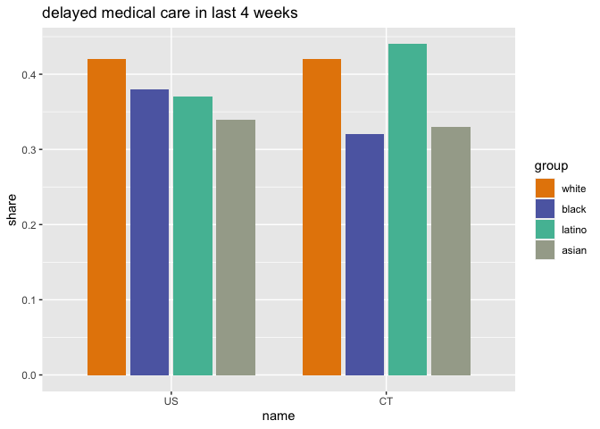<!-- -->

# by group

## work loss

``` r
by_group$work_loss <- srvys %>%
  compare_grps(wrkloss) %>%
  map(filter, wrkloss == "loss") %>%
  combine_dimensions(c(wks_incl, wrkloss))
```

    ## Adding missing grouping variables: `wks_incl`
    ## Adding missing grouping variables: `wks_incl`

## food insecurity (current)

``` r
by_group$food_insecurity <- srvys %>%
  compare_grps(current_food) %>%
  map(filter, current_food == "insecure") %>%
  combine_dimensions(c(wks_incl, current_food))
```

change less in share not having enough food, but share having limited
options

``` r
by_group$food_insecurity_change <- list(
  srvys %>%
    map(filter, !is.na(prior_food), !is.na(current_food)) %>%
    compare_share(kids_present, prior_food) %>%
    filter(prior_food != "secure"),
  srvys %>%
    map(filter, !is.na(prior_food), !is.na(current_food)) %>%
    compare_share(kids_present, current_food) %>%
    filter(current_food != "secure")
) %>%
  map(select, -share_se) %>%
  map_dfr(pivot_longer, ends_with("_food"), names_to = "variable", values_to = "group", names_ptypes = list(variable = factor()))

by_group$food_insecurity_change %>%
  ggplot(aes(x = variable, y = share, fill = group)) +
  geom_col(position = position_stack(), width = 0.8) +
  scale_fill_carto_d(palette = "Vivid") +
  facet_wrap(vars(name, kids_present)) +
  labs(title = "previous vs current food insecurity")
```

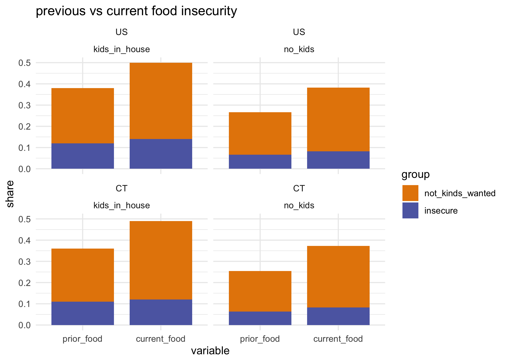<!-- -->

## received free food

``` r
by_group$free_food <- srvys %>%
  compare_grps(freefood) %>%
  map(filter, freefood == "received_food") %>%
  combine_dimensions(c(wks_incl, freefood))
```

## delayed care

``` r
by_group$delayed_med_care <- srvys %>%
  compare_grps(delay_care) %>%
  map(filter, delay_care == "delayed") %>%
  combine_dimensions(c(wks_incl, delay_care))
```

## missed care

``` r
by_group$missed_med_care <- srvys %>%
  compare_grps(miss_care) %>%
  map(filter, miss_care == "missed") %>%
  combine_dimensions(c(wks_incl, miss_care))
```

## anxiety

``` r
by_group$anxiety <- srvys %>%
  compare_grps(anxious) %>%
  map(filter, anxious == "most_all_days") %>%
  combine_dimensions(c(wks_incl, anxious))
```

## housing insecurity—next month

``` r
by_group$housing_insecurity <- srvys %>%
  compare_grps(housing_conf) %>%
  map(filter, housing_conf == "not_confident") %>%
  combine_dimensions(c(wks_incl, housing_conf))
```

### renters only

``` r
by_group$renter_insecurity <- srvys %>%
  map(filter, tenure == "rent") %>%
  compare_grps(housing_conf) %>%
  map(filter, housing_conf == "not_confident") %>%
  combine_dimensions(c(wks_incl, housing_conf))
```

## internet reliably available for kids’ education

kinda messy & large MOEs, not keeping

``` r
# messy
internet_no_output <- srvys %>%
  compare_grps(internet, age_range = FALSE, kids_present = FALSE) %>%
  map(filter, internet == "not_reliable") %>%
  combine_dimensions(c(wks_incl, internet))
```

``` r
compare_bars <- function(df) {
  ggplot(df, aes(x = fct_rev(group), y = share, fill = dimension)) +
  geom_col(width = 0.8) +
  coord_flip() +
  scale_y_continuous(expand = expansion(mult = c(0, 0.05)), labels = scales::percent_format(accuracy = 1)) +
  scale_fill_carto_d(palette = "Vivid") +
  facet_grid(rows = vars(dimension), scales = "free_y", space = "free") +
  theme_minimal() +
  theme(legend.position = "none",
        axis.ticks = element_blank(),
        plot.title.position = "plot") +
    labs(subtitle = "CT groups, all weeks", x = NULL, y = NULL)
}
```

``` r
by_group <- by_group %>% map(filter, group != "other")

by_group$work_loss %>%
  filter(name == "CT" | dimension == "total") %>%
  compare_bars() +
  labs(x = NULL, y = NULL,
       title = "loss of employment income since 3/13")
```

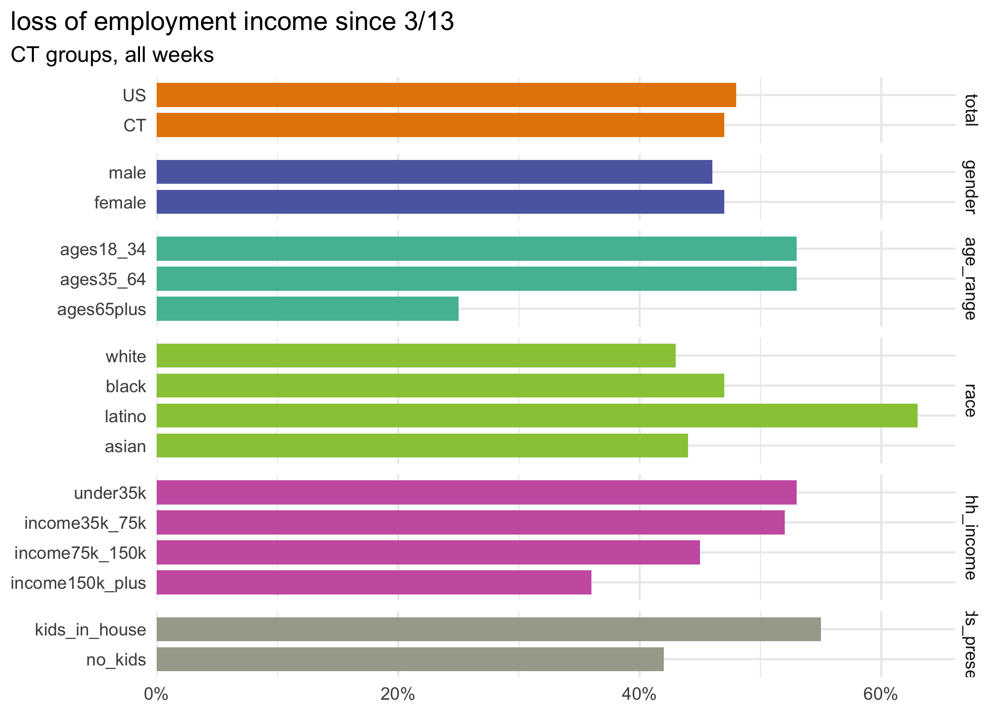<!-- -->

``` r
by_group$food_insecurity %>%
  filter(name == "CT" | dimension == "total") %>%
  compare_bars() +
  labs(x = NULL, y = NULL,
       title = "food insecurity in past 7 days")
```

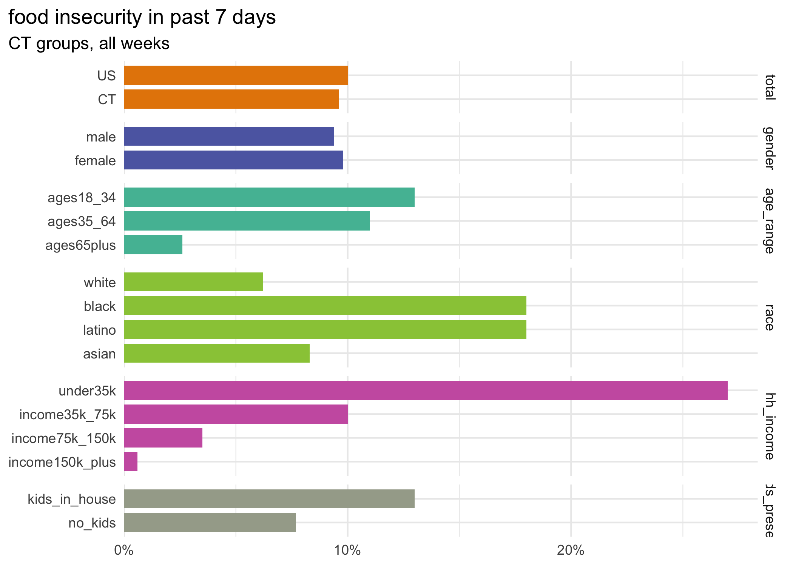<!-- -->

``` r
by_group$delayed_med_care  %>%
  filter(name == "CT" | dimension == "total") %>%
  compare_bars() +
  labs(x = NULL, y = NULL,
       title = "delayed medical care in past 4 weeks")
```

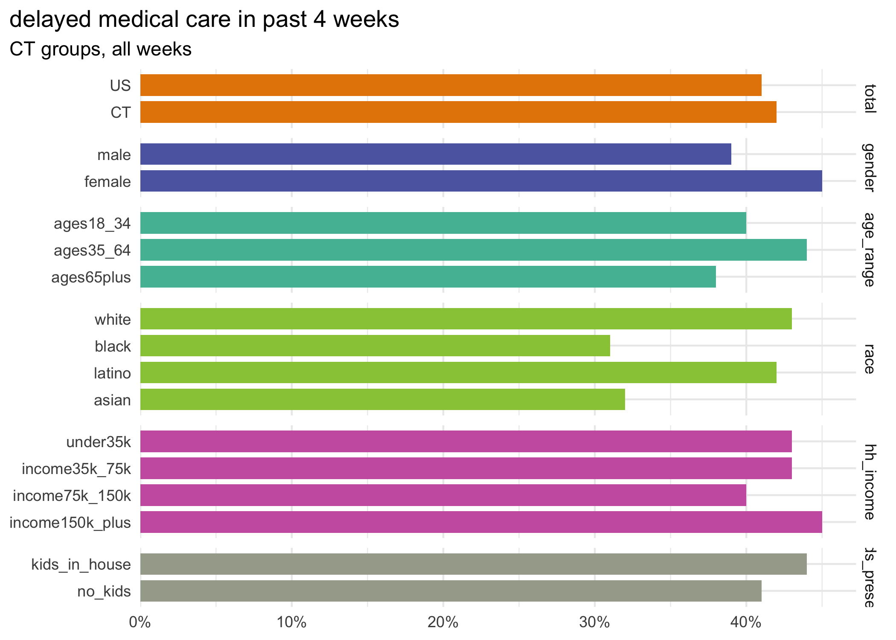<!-- -->

``` r
by_group$missed_med_care  %>%
  filter(name == "CT" | dimension == "total") %>%
  compare_bars() +
  labs(x = NULL, y = NULL,
       title = "missed medical care not related to covid in past 4 weeks")
```

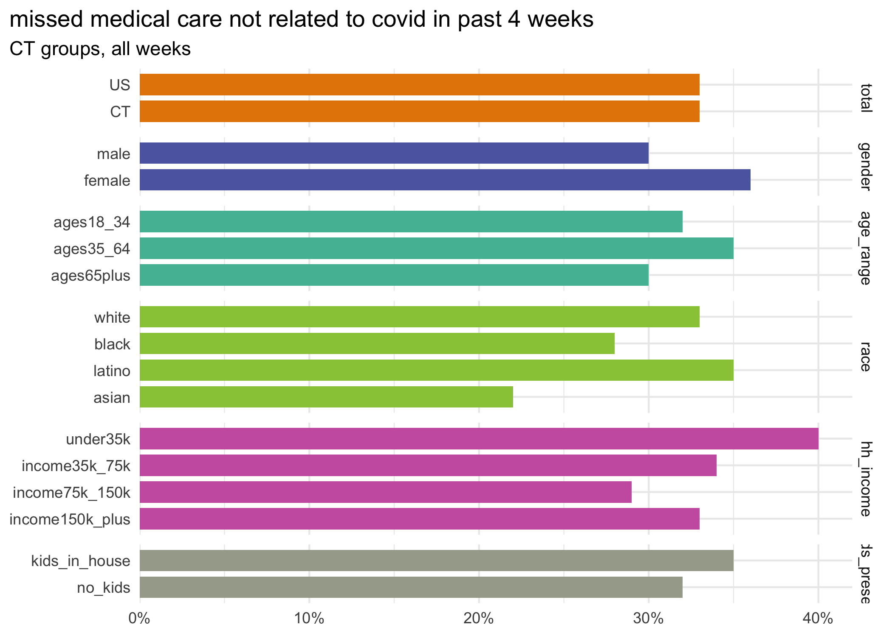<!-- -->

``` r
by_group$anxiety %>%
  filter(name == "CT" | dimension == "total") %>%
  compare_bars() +
  labs(x = NULL, y = NULL,
       title = "anxiety half the days in past week or more")
```

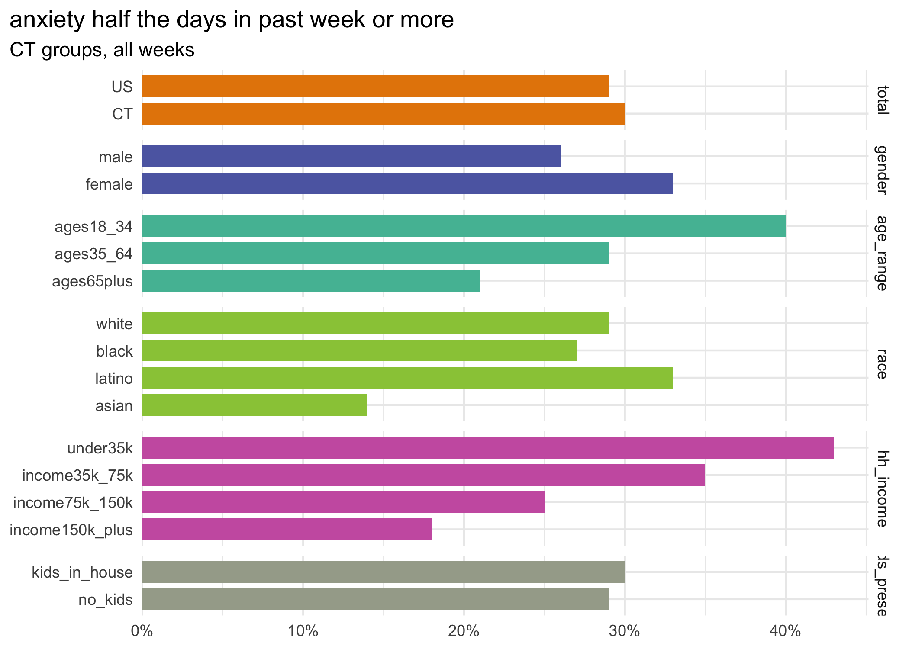<!-- -->

``` r
by_group$housing_insecurity %>%
  filter(name == "CT" | dimension == "total") %>%
  compare_bars() +
  labs(x = NULL, y = NULL,
       title = "little/no confidence in making next housing payment")
```

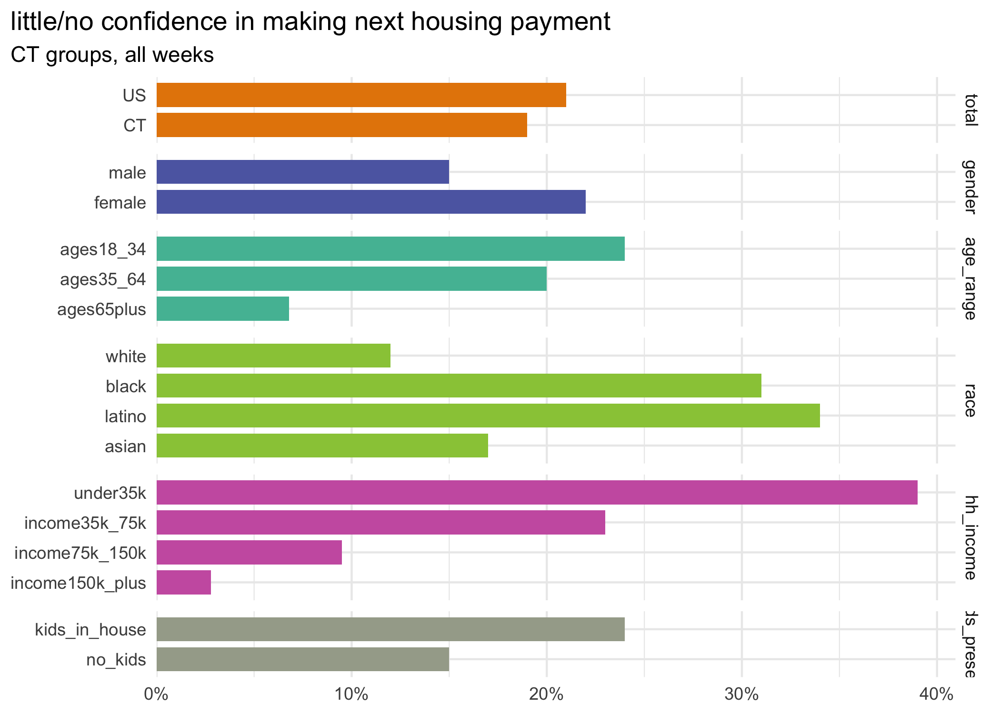<!-- -->

``` r
by_group$renter_insecurity %>%
  filter(name == "CT" | dimension == "total") %>%
  compare_bars() +
  labs(x = NULL, y = NULL,
       title = "little/no confidence in making next housing payment--renters only")
```

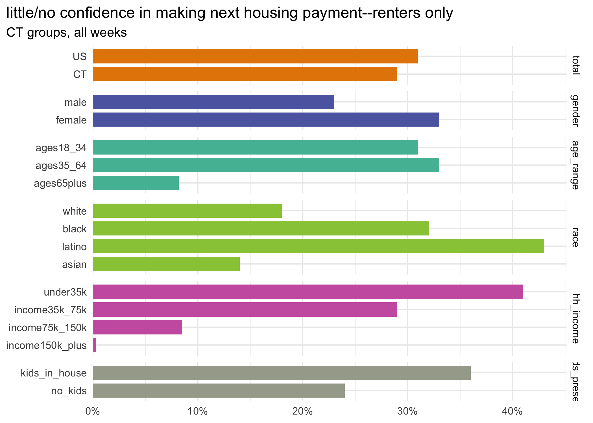<!-- -->

``` r
saveRDS(trends, here::here("output_data/hhp_trends.rds"))
saveRDS(by_group, here::here("output_data/hhp_by_group.rds"))
```

# specific food access questions

food sufficiency questions universe: current food not enough / not types
wanted

``` r
# just a little easier to handle food vars separately
food_df <- pums_df %>%
  select(state:hh_income, race, age_range, kids_present, current_food, cant_afford = foodsufrsn1, transportation = foodsufrsn2, afraid_to_go_out = foodsufrsn3, need_delivered = foodsufrsn4, stores_didnt_have_food = foodsufrsn5, freefood, school = wherefree1, pantry = wherefree2, home_delivery = wherefree3, church = wherefree4, shelter = wherefree5, comm_program = wherefree6, family = wherefree7) %>%
  mutate_at(vars(cant_afford:stores_didnt_have_food), ~case_when(
    current_food == "secure" ~ NA_character_,
    is.na(.) ~ "didnt_need",
    TRUE ~ "needed"
  ) %>% as.factor()) %>%
  mutate_at(vars(school:family), ~case_when(
    freefood == "no_free_food" ~ NA_character_,
    is.na(.) ~ "didnt_use_source",
    TRUE ~ "used_source"
  ) %>% as.factor())

summary(food_df)
```

    ##     state             wks_incl              week          start_date        
    ##  Length:909917      Length:909917      3      :132961   Min.   :2020-04-23  
    ##  Class :character   Class :character   8      :108062   1st Qu.:2020-05-14  
    ##  Mode  :character   Mode  :character   5      :105066   Median :2020-05-28  
    ##                                        4      :101215   Mean   :2020-06-01  
    ##                                        9      : 98663   3rd Qu.:2020-06-18  
    ##                                        10     : 90767   Max.   :2020-07-02  
    ##                                        (Other):273183                       
    ##     end_date             scram              pweight            gender      
    ##  Min.   :2020-05-05   Length:909917      Min.   :     2.0   male  :368379  
    ##  1st Qu.:2020-05-19   Class :character   1st Qu.:   303.1   female:541538  
    ##  Median :2020-06-02   Mode  :character   Median :   812.9                  
    ##  Mean   :2020-06-06                      Mean   :  2738.4                  
    ##  3rd Qu.:2020-06-23                      3rd Qu.:  2323.7                  
    ##  Max.   :2020-07-07                      Max.   :447765.7                  
    ##                                                                            
    ##            hh_income          race             age_range     
    ##  under35k       :156437   white :691463   ages18_34 :149211  
    ##  income35k_75k  :227015   black : 68111   ages35_64 :536265  
    ##  income75k_150k :258748   latino: 78311   ages65plus:224441  
    ##  income150k_plus:146650   asian : 39698                      
    ##  NA's           :121067   other : 32334                      
    ##                                                              
    ##                                                              
    ##         kids_present              current_food        cant_afford    
    ##  kids_in_house:322892   secure          :597176   didnt_need:198890  
    ##  no_kids      :587025   not_kinds_wanted:239679   needed    :113851  
    ##                         insecure        : 55172   NA's      :597176  
    ##                         NA's            : 17890                      
    ##                                                                      
    ##                                                                      
    ##                                                                      
    ##     transportation     afraid_to_go_out     need_delivered  
    ##  didnt_need:279163   didnt_need:232316   didnt_need:292859  
    ##  needed    : 33578   needed    : 80425   needed    : 19882  
    ##  NA's      :597176   NA's      :597176   NA's      :597176  
    ##                                                             
    ##                                                             
    ##                                                             
    ##                                                             
    ##  stores_didnt_have_food          freefood                   school      
    ##  didnt_need:167666      received_food: 55742   didnt_use_source: 51745  
    ##  needed    :145075      no_free_food :833331   used_source     : 24841  
    ##  NA's      :597176      NA's         : 20844   NA's            :833331  
    ##                                                                         
    ##                                                                         
    ##                                                                         
    ##                                                                         
    ##               pantry                home_delivery                 church      
    ##  didnt_use_source: 62793   didnt_use_source: 74257   didnt_use_source: 69407  
    ##  used_source     : 13793   used_source     :  2329   used_source     :  7179  
    ##  NA's            :833331   NA's            :833331   NA's            :833331  
    ##                                                                               
    ##                                                                               
    ##                                                                               
    ##                                                                               
    ##              shelter                 comm_program                 family      
    ##  didnt_use_source: 75941   didnt_use_source: 65003   didnt_use_source: 63255  
    ##  used_source     :   645   used_source     : 11583   used_source     : 13331  
    ##  NA's            :833331   NA's            :833331   NA's            :833331  
    ##                                                                               
    ##                                                                               
    ##                                                                               
    ## 

``` r
fsrvys <- list(
  us = as_survey_design(food_df, weights = pweight),
  ct = as_survey_design(food_df %>% filter(state == "09"), weights = pweight)
) %>%
  map(group_by, wks_incl)
```

## sources of free food

of adults getting free food in past 7 days

``` r
food_sources <- food_df %>%
  select(school:family) %>%
  names() %>%
  set_names() %>%
  map(function(col_name) {
    col <- sym(col_name)
    fsrvys %>%
      compare_grps({{ col }}, hh_income = FALSE) %>%
      map(filter, {{ col }} == "used_source") %>%
      combine_dimensions(c(wks_incl, {{ col }}))
  }) %>%
  map(filter, group != "other")
```

``` r
food_sources$school %>%
  filter(name == "CT" | dimension == "total") %>%
  compare_bars() +
  labs(title = "received free food through schools, other kids' programs",
       caption = "of adults receiving free food in past 7 days")
```

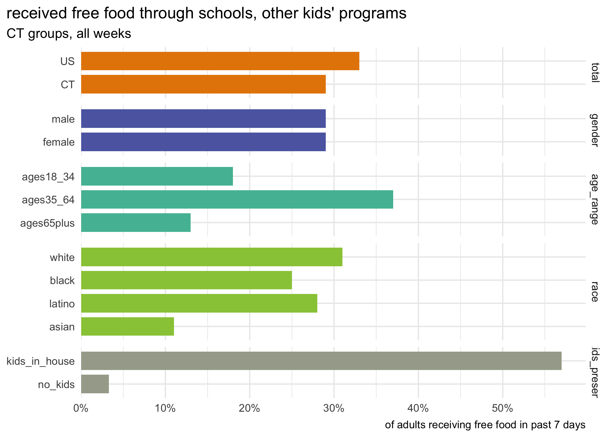<!-- -->

``` r
food_sources$family %>%
  filter(name == "CT" | dimension == "total") %>%
  compare_bars() +
  labs(title = "received free food through family or friends",
       caption = "of adults receiving free food in past 7 days")
```

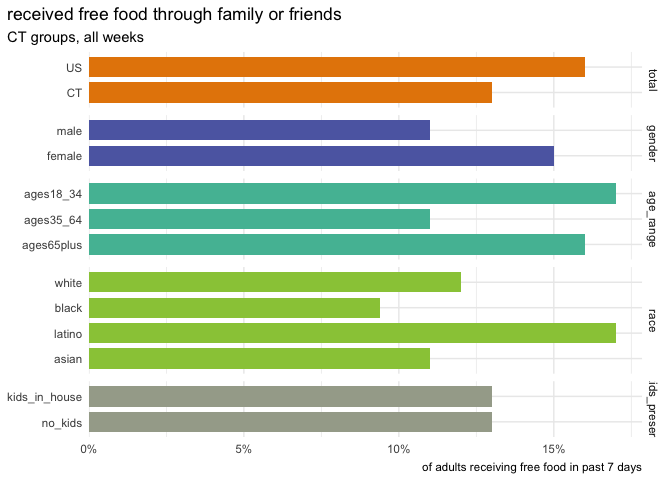<!-- -->

``` r
food_sources$pantry %>%
  filter(name == "CT" | dimension == "total") %>%
  compare_bars() +
  labs(title = "received free food through food pantry / food bank",
       caption = "of adults receiving free food in past 7 days")
```

<!-- -->

Key takeaway: people living with kids rely heavily on schools for food,
whereas people not living with kids & seniors rely heavily on food
pantries & food banks.

``` r
food_sources %>%
  map_dfr(pivot_longer, -c(name, wks_incl, share:group), names_to = "source") %>%
  filter(name == "CT", dimension == "total") %>%
  mutate(source = as_factor(source) %>% fct_reorder(share, .fun = max)) %>%
  ggplot(aes(x = source, y = share)) +
  geom_col(width = 0.8, fill = "#008b60") +
  geom_text(aes(label = scales::percent(share, accuracy = 1)), color = "white", hjust = 1, nudge_y = -2e-3, size = 2.5, fontface = "bold") +
  scale_y_continuous(expand = expansion(mult = c(0, 0.05)), breaks = NULL) +
  coord_flip() +
  theme_minimal() +
  theme(panel.grid = element_blank(),
        axis.ticks = element_blank(),
        plot.title.position = "plot") +
  labs(title = "source of free food",
       x = NULL, y = NULL)
```

<!-- -->

## barriers to food access

of adults experiencing shortage of food / desired types of food in past
7 days

``` r
food_barriers <- food_df %>%
  select(cant_afford:stores_didnt_have_food) %>%
  names() %>%
  set_names() %>%
  map(function(col_name) {
    col <- sym(col_name)
    fsrvys %>%
      compare_grps({{ col }}, hh_income = FALSE) %>%
      map(filter, {{ col }} == "needed") %>%
      combine_dimensions(c(wks_incl, {{ col }}))
  }) %>%
  map(filter, group != "other")
```

``` r
food_barriers$cant_afford %>%
  filter(name == "CT" | dimension == "total") %>%
  compare_bars() +
  labs(title = "couldn't afford food",
       caption = "of adults not having enough / desired food in past 7 days")
```

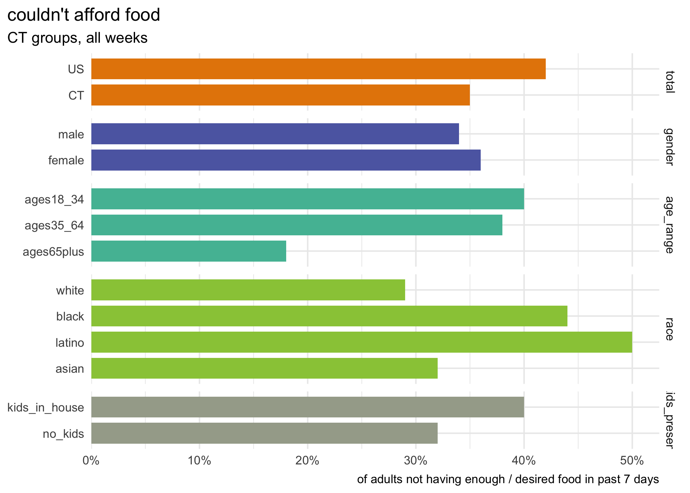<!-- -->

``` r
food_barriers$transportation %>%
  filter(name == "CT" | dimension == "total") %>%
  compare_bars() +
  labs(title = "needed transportation to get food",
       caption = "of adults not having enough / desired food in past 7 days")
```

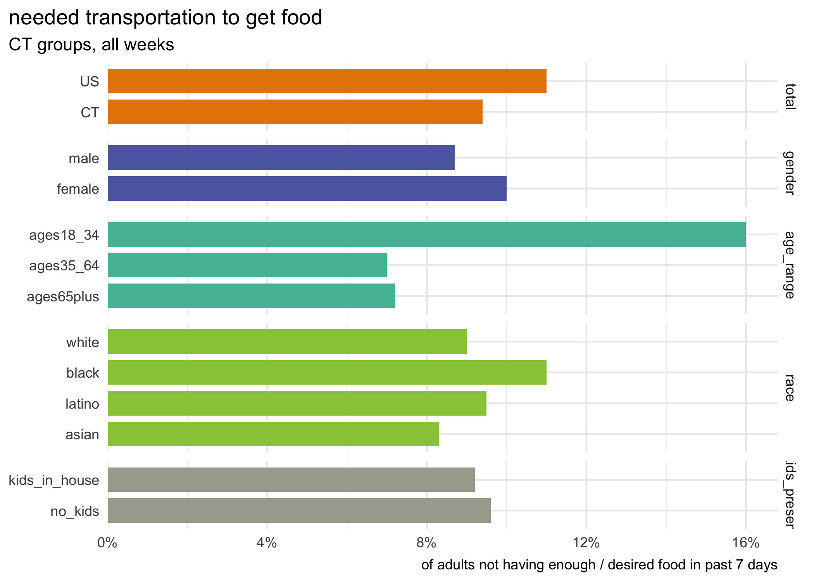<!-- -->

``` r
food_barriers$need_delivered %>%
  filter(name == "CT" | dimension == "total") %>%
  compare_bars() +
  labs(title = "needed food delivered",
       caption = "of adults not having enough / desired food in past 7 days")
```

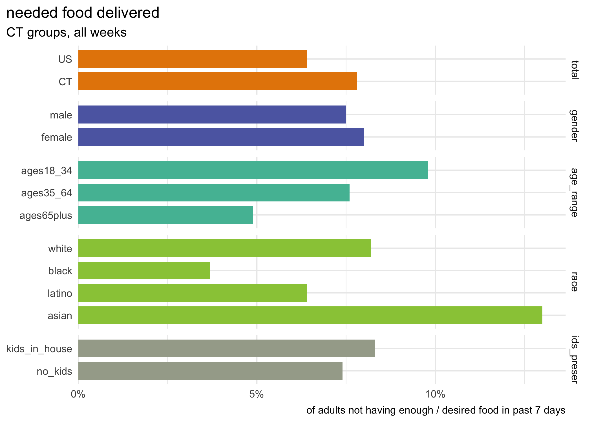<!-- -->

## resources x health

Interested in how anxiety differs by food insecurity, housing
insecurity, etc

``` r
resource_x_health <- list()
```

``` r
resource_x_health$anxiety_x_food <- srvys %>%
  map(filter, !is.na(current_food), !is.na(anxious)) %>%
  compare_share(current_food, anxious) %>%
  filter(anxious == "most_all_days", name == "CT")

resource_x_health$anxiety_x_housing <- srvys %>%
  map(filter, !is.na(housing_conf), !is.na(anxious)) %>%
  compare_share(housing_conf, anxious) %>%
  filter(anxious == "most_all_days", name == "CT")

resource_x_health$anxiety_x_delay_care <- srvys %>%
  map(filter, !is.na(delay_care), !is.na(anxious)) %>%
  compare_share(delay_care, anxious) %>%
  filter(anxious == "most_all_days", name == "CT")

resource_x_health$anxiety_x_tenure <- srvys %>%
  map(filter, !is.na(tenure), !is.na(anxious)) %>%
  compare_share(tenure, anxious) %>%
  filter(anxious == "most_all_days", name == "CT", tenure != "other")

resource_x_health %>%
  map_dfr(pivot_longer, c(-name, -wks_incl, -anxious, -starts_with("share")), names_to = "measure", values_to = "group") %>%
  mutate_at(vars(measure, group), fct_relabel, camiller::clean_titles) %>%
  mutate(measure = fct_recode(measure, "Food insecure" = "Current food", "Confidence in next housing payment" = "Housing conf")) %>%
  ggplot(aes(x = group, y = share)) +
  geom_col(width = 0.8, fill = "#008b60") +
  geom_text(aes(label = scales::percent(share, accuracy = 1)), size = 2.8, hjust = 1, nudge_y = -8e-3, fontface = "bold", color = "white") +
  scale_y_continuous(expand = expansion(mult = c(0, 0.05)), breaks = NULL) +
  facet_grid(rows = vars(measure), scales = "free", space = "free", switch = "y",
             labeller = labeller(measure = label_wrap_gen(20))) +
  coord_flip() +
  labs(x = NULL, y = NULL,
       title = "Anxiety rate vs access to resources") +
  theme(strip.text.y = element_text(angle = 0, face = "bold"),
        strip.placement = "outside",
        panel.grid = element_blank(),
        plot.title.position = "plot",
        panel.spacing = unit(0.2, "in"))
```

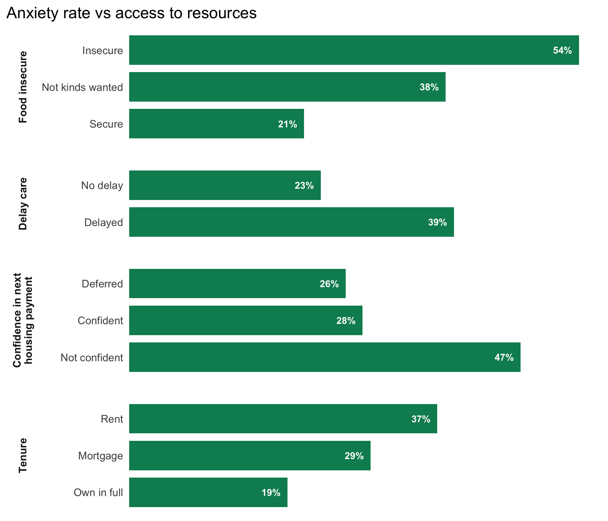<!-- -->

Not super surprising: people are more anxious who have also been food
insecure, delayed medical care, worried about next housing payment, and
who rent. Definitely more we could dig into here.

``` r
saveRDS(food_sources, here::here("output_data/hhp_sources_of_food.rds"))
saveRDS(food_barriers, here::here("output_data/hhp_barriers_to_food.rds"))
```

``` r
write_csv(week_dates, here::here("_utils/pums_week_dates.csv"))
```

Not ready yet: curious about how many people have become food insecure /
experienced insecurity at some point

``` r
rep_ids <- all_pums %>%
  map_dfr(janitor::clean_names, .id = "wk") %>%
  filter(est_st == "09", !is.na(curfoodsuf)) %>%
  count(scram) %>%
  arrange(-n) %>%
  filter(n > 1)

ct_srvy %>%
  filter(!is.na(current_food)) %>%
  # as_tibble() %>%
  group_by(scram) %>%
  mutate(insecure = current_food == "insecure",
         insecure_so_far = cumsum(insecure) > 0) %>%
  ungroup() %>%
  select(scram, week, current_food, insecure, insecure_so_far) %>%
  # arrange(scram)
  group_by(week) %>%
  summarise(share_current = survey_mean(insecure, na.rm = TRUE),
            share_ever = survey_mean(insecure_so_far, na.rm = TRUE, vartype = "ci", level = 0.9))
```

    ## # A tibble: 10 x 6
    ##    week  share_current share_current_se share_ever share_ever_low share_ever_upp
    ##    <fct>         <dbl>            <dbl>      <dbl>          <dbl>          <dbl>
    ##  1 1            0.0895           0.0167     0.0895         0.0620          0.117
    ##  2 2            0.0869           0.0222     0.0990         0.0611          0.137
    ##  3 3            0.119            0.0282     0.135          0.0872          0.182
    ##  4 4            0.0912           0.0210     0.114          0.0753          0.152
    ##  5 5            0.0965           0.0167     0.107          0.0787          0.135
    ##  6 6            0.102            0.0231     0.112          0.0735          0.151
    ##  7 7            0.103            0.0231     0.113          0.0739          0.152
    ##  8 8            0.102            0.0171     0.126          0.0926          0.160
    ##  9 9            0.0922           0.0141     0.113          0.0850          0.141
    ## 10 10           0.0938           0.0155     0.0938         0.0683          0.119
