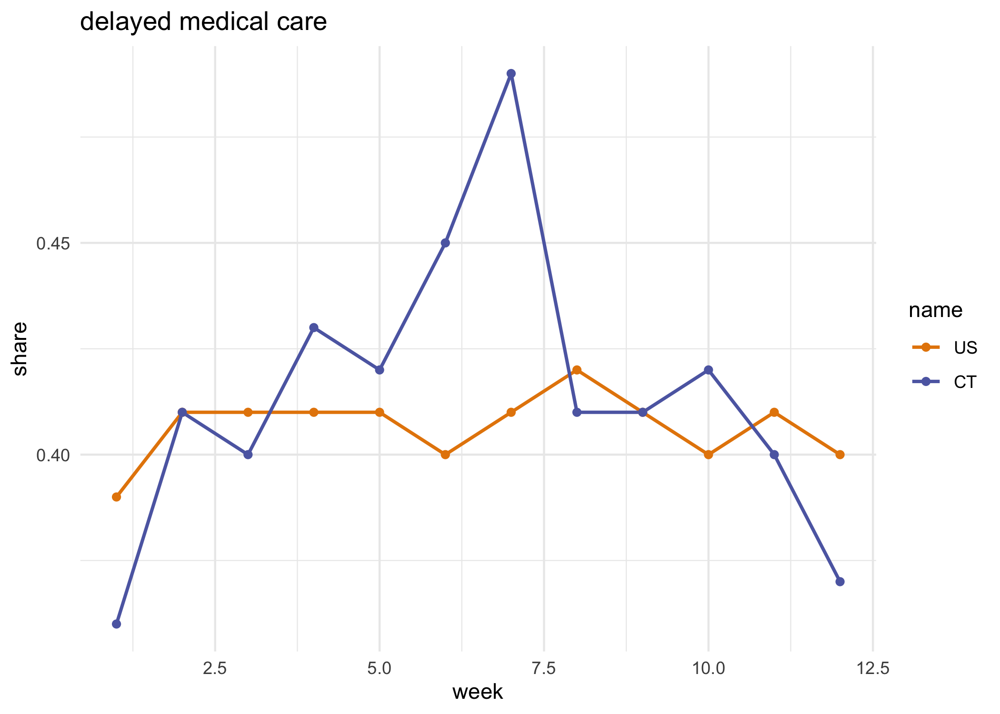
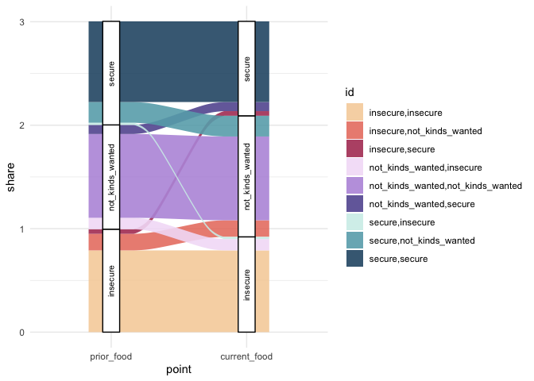
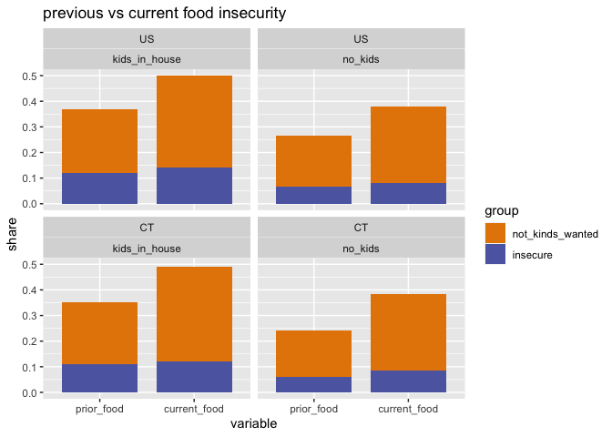
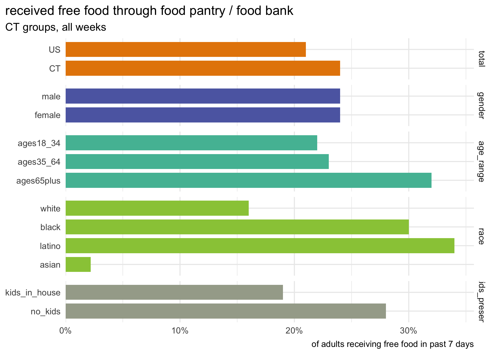
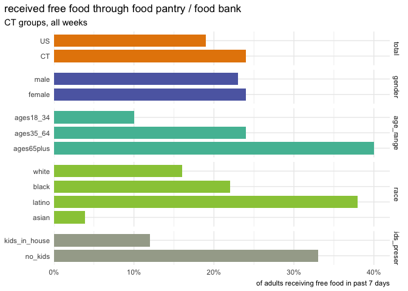

pums analysis, multi weeks
================

``` r
library(tidyverse)
library(srvyr)
library(rvest)
library(rcartocolor)
library(ggalluvial)
```

# functions & cleanup

``` r
survey_share_by <- function(srvy, ..., .add, digits = 2, vartype = "se") {
  grp_vars <- quos(...)
  # dplyr has moved to .add, but srvyr not updated yet
  srvy %>%
    group_by(!!!grp_vars, add = .add) %>%
    summarise(share = survey_mean(vartype = vartype, level = 0.9)) %>%
    mutate_at(vars(matches("share")), signif, digits = digits)
}

compare_share <- function(srvy_lst, ..., .add = TRUE) {
  srvy_lst %>%
    map_dfr(survey_share_by, ..., .add = .add, .id = "name") %>%
    mutate(name = as_factor(name) %>% fct_relabel(toupper))
}

compare_grps <- function(srvy_list = srvys, col, total = TRUE, gender = TRUE, age_range = TRUE, race = TRUE, hh_income = TRUE, kids_present = TRUE) {
  # still kinda redundant
  filtered <- srvy_list %>%
    map(filter, !is.na({{ col }}))
  
  out <- list()
  
  if (total) out$total <- compare_share(filtered, total = "total", {{ col }})
  if (gender) out$by_gender <- compare_share(filtered, gender, {{ col }})
  if (age_range) out$by_age <- compare_share(filtered, age_range, {{ col }})
  if (race) out$by_race <- compare_share(filtered, race, {{ col }})
  if (hh_income) out$by_income <- compare_share(filtered, hh_income, {{ col }})
  if (kids_present) out$by_kids <- compare_share(filtered, kids_present, {{ col }})
  
  out
}

combine_dimensions <- function(dfs, ...) {
  drop_vars <- quos(...)
  dfs %>%
    map(ungroup) %>%
    # map(select, -{{ drop_col }}, -share_se) %>%
    map_dfr(pivot_longer, -c(name, starts_with("share"), !!!drop_vars), names_to = "dimension", values_to = "group",
            names_ptypes = list(dimension = factor())) %>%
    filter(!is.na(group)) %>%
    mutate(group = as_factor(ifelse(group == "total", as.character(name), as.character(group))))
}
```

``` r
week_dates <- read_html("https://www.census.gov/programs-surveys/household-pulse-survey/datasets.html") %>%
  html_nodes("h4.uscb-h4") %>%
  html_text() %>%
  str_match_all("([A-Z][a-z]+ \\d{1,2})") %>%
  map(~.[, 1]) %>%
  rev() %>%
  map(paste, "2020") %>%
  map(lubridate::mdy) %>%
  map(enframe, name = "pt", value = "date") %>%
  map_dfr(mutate, pt = fct_recode(as.character(pt), start = "1", end = "2"), .id = "week") %>%
  pivot_wider(names_from = pt, names_glue = "{pt}_{.value}", values_from = date) %>%
  mutate(week = as.numeric(week))
```

``` r
all_pums <- list.files(here::here("fetch_data/microdata"), full.names = TRUE) %>%
  map(readRDS)

pums_df <- all_pums %>% 
  map(janitor::clean_names) %>%
  map_dfr(select, state = est_st, week, pweight, birth_year = tbirth_year, gender = egender, rhispanic, rrace, hh_income = income, nkids = thhld_numkid, wrkloss, prior_food = prifoodsuf, current_food = curfoodsuf, delay_care = delay, miss_care = notget, tenure, last_housing = mortlmth, housing_conf = mortconf, internet = intrntavail, starts_with("foodsufr"), freefood, starts_with("wherefree")) %>%
  mutate_at(vars(-state:-birth_year, -nkids), ~ifelse(. < 0, NA, .)) %>%
  mutate_at(vars(-state:-birth_year, -nkids, -rhispanic, -rrace, -starts_with("foodsufr"), -starts_with("wherefree")), as.factor) %>%
  mutate_at(vars(starts_with("foodsufr"), starts_with("wherefree")), as.logical) %>%
  mutate(race = ifelse(rhispanic == 2, "latino", rrace) %>%
           as.factor() %>%
           fct_recode(white = "1", black = "2", asian = "3", other = "4") %>%
           fct_relevel("white", "black", "latino"),
         gender = fct_recode(gender, male = "1", female = "2"),
         wrkloss = fct_recode(wrkloss, loss = "1", no_loss = "2"),
         delay_care = fct_recode(delay_care, delayed = "1", no_delay = "2"),
         miss_care = fct_recode(miss_care, missed = "1", no_miss = "2"),
         tenure = fct_recode(tenure, own_in_full = "1", mortgage = "2", rent = "3", other = "4"),
         last_housing = fct_recode(last_housing, on_time = "1", late = "2", deferred = "3"),
         housing_conf = fct_collapse(housing_conf, not_confident = c("1", "2"), confident = c("3", "4"), deferred = "5"),
         internet = fct_collapse(internet, always_usually = c("1", "2"), not_reliable = c("3", "4", "5")),
         hh_income = fct_collapse(hh_income, under35k = c("1", "2"), income35k_75k = c("3", "4"), income75k_150k = c("5", "6"), income150k_plus = c("7", "8")),
         age = 2020 - birth_year,
         kids_present = as.factor(ifelse(nkids > 0, "kids_in_house", "no_kids")),
         freefood = fct_recode(freefood, received_food = "1", no_free_food = "2"),
         age_range = cut(age, breaks = c(18, 34, 64, Inf), labels = c("ages18_34", "ages35_64", "ages65plus"), include.lowest = TRUE),
         wks_incl = paste(range(as.numeric(week)), collapse = "_")
  ) %>%
  mutate_at(vars(prior_food, current_food), fct_collapse, secure = "1", not_kinds_wanted = "2", insecure = c("3", "4")) %>%
  left_join(week_dates, by = "week") %>%
  mutate(week = as.factor(week)) %>%
  select(state, wks_incl, week, start_date, end_date, everything(), -rhispanic, -rrace, -birth_year)

summary(pums_df)
```

    ##     state             wks_incl         week         start_date        
    ##  Length:612425      Length:612425      1: 74413   Min.   :2020-04-23  
    ##  Class :character   Class :character   2: 41996   1st Qu.:2020-05-14  
    ##  Mode  :character   Mode  :character   3:132961   Median :2020-05-21  
    ##                                        4:101215   Mean   :2020-05-20  
    ##                                        5:105066   3rd Qu.:2020-06-04  
    ##                                        6: 83302   Max.   :2020-06-11  
    ##                                        7: 73472                       
    ##     end_date             pweight            gender      
    ##  Min.   :2020-05-05   Min.   :     2.0   male  :249130  
    ##  1st Qu.:2020-05-19   1st Qu.:   304.6   female:363295  
    ##  Median :2020-05-26   Median :   855.6                  
    ##  Mean   :2020-05-26   Mean   :  2848.0                  
    ##  3rd Qu.:2020-06-09   3rd Qu.:  2446.6                  
    ##  Max.   :2020-06-16   Max.   :447765.7                  
    ##                                                         
    ##            hh_income          nkids           wrkloss      
    ##  under35k       :102892   Min.   :0.0000   loss   :237123  
    ##  income35k_75k  :151244   1st Qu.:0.0000   no_loss:371833  
    ##  income75k_150k :174614   Median :0.0000   NA's   :  3469  
    ##  income150k_plus: 99856   Mean   :0.6616                   
    ##  NA's           : 83819   3rd Qu.:1.0000                   
    ##                           Max.   :5.0000                   
    ##                                                            
    ##             prior_food               current_food       delay_care    
    ##  secure          :467088   secure          :403831   delayed :240800  
    ##  not_kinds_wanted:103053   not_kinds_wanted:160313   no_delay:306839  
    ##  insecure        : 30608   insecure        : 36351   NA's    : 64786  
    ##  NA's            : 11676   NA's            : 11930                    
    ##                                                                       
    ##                                                                       
    ##                                                                       
    ##    miss_care              tenure         last_housing           housing_conf   
    ##  missed :186754   own_in_full:131361   on_time :363627   not_confident: 52949  
    ##  no_miss:361609   mortgage   :271551   late    : 30214   confident    :345213  
    ##  NA's   : 64062   rent       :136256   deferred: 12246   deferred     :  8249  
    ##                   other      :  6963   NA's    :206338   NA's         :206014  
    ##                   NA's       : 66294                                           
    ##                                                                                
    ##                                                                                
    ##            internet      foodsufrsn1    foodsufrsn2    foodsufrsn3   
    ##  always_usually:136001   Mode:logical   Mode:logical   Mode:logical  
    ##  not_reliable  :  9879   TRUE:70190     TRUE:21017     TRUE:51956    
    ##  NA's          :466545   NA's:542235    NA's:591408    NA's:560469   
    ##                                                                      
    ##                                                                      
    ##                                                                      
    ##                                                                      
    ##  foodsufrsn4    foodsufrsn5             freefood      wherefree1    
    ##  Mode:logical   Mode:logical   received_food: 36262   Mode:logical  
    ##  TRUE:13635     TRUE:104613    no_free_food :562252   TRUE:16796    
    ##  NA's:598790    NA's:507812    NA's         : 13911   NA's:595629   
    ##                                                                     
    ##                                                                     
    ##                                                                     
    ##                                                                     
    ##  wherefree2     wherefree3     wherefree4     wherefree5     wherefree6    
    ##  Mode:logical   Mode:logical   Mode:logical   Mode:logical   Mode:logical  
    ##  TRUE:8206      TRUE:1464      TRUE:3972      TRUE:361       TRUE:7415     
    ##  NA's:604219    NA's:610961    NA's:608453    NA's:612064    NA's:605010   
    ##                                                                            
    ##                                                                            
    ##                                                                            
    ##                                                                            
    ##  wherefree7         race             age               kids_present   
    ##  Mode:logical   white :467612   Min.   :18.00   kids_in_house:215782  
    ##  TRUE:7994      black : 45330   1st Qu.:39.00   no_kids      :396643  
    ##  NA's:604431    latino: 51206   Median :52.00                         
    ##                 asian : 27039   Mean   :51.68                         
    ##                 other : 21238   3rd Qu.:64.00                         
    ##                                 Max.   :88.00                         
    ##                                                                       
    ##       age_range     
    ##  ages18_34 : 99257  
    ##  ages35_64 :360694  
    ##  ages65plus:152474  
    ##                     
    ##                     
    ##                     
    ## 

``` r
us_srvy <- as_survey_design(pums_df, weights = pweight)
ct_srvy <- as_survey_design(pums_df %>% filter(state == "09"), weights = pweight)
srvys <- lst(us_srvy, ct_srvy) %>% 
  set_names(substr, 1, 2) %>%
  # assume grouped for all weeks
  map(group_by, wks_incl)
```

    ## Warning: The `add` argument of `group_by()` is deprecated as of dplyr 1.0.0.
    ## Please use the `.add` argument instead.
    ## This warning is displayed once every 8 hours.
    ## Call `lifecycle::last_warnings()` to see where this warning was generated.

``` r
trends <- list()
by_group <- list()
```

# trends

in general, there aren’t really any changes over time. so at least
things aren’t getting *worse*, but don’t seem to be letting up either.
interesting since some of the questions are cumulative, e.g. work loss
is any loss since 3/13, so you’d imagine that number would continue to
grow, but it hasn’t so far. suggests that by the time the first week of
the survey was done (4/23), that damage had already been done.

## lost work

no change

``` r
trends$work_loss <- srvys %>%
  map(filter, !is.na(wrkloss)) %>%
  compare_share(week, wrkloss) %>%
  filter(wrkloss == "loss") 

trends$work_loss
```

    ## # A tibble: 14 x 6
    ##    name  wks_incl week  wrkloss share share_se
    ##    <fct> <chr>    <fct> <fct>   <dbl>    <dbl>
    ##  1 US    1_7      1     loss     0.47   0.0041
    ##  2 US    1_7      2     loss     0.47   0.006 
    ##  3 US    1_7      3     loss     0.48   0.0054
    ##  4 US    1_7      4     loss     0.48   0.0047
    ##  5 US    1_7      5     loss     0.48   0.0041
    ##  6 US    1_7      6     loss     0.48   0.0046
    ##  7 US    1_7      7     loss     0.48   0.0055
    ##  8 CT    1_7      1     loss     0.47   0.025 
    ##  9 CT    1_7      2     loss     0.46   0.039 
    ## 10 CT    1_7      3     loss     0.48   0.031 
    ## 11 CT    1_7      4     loss     0.47   0.026 
    ## 12 CT    1_7      5     loss     0.48   0.022 
    ## 13 CT    1_7      6     loss     0.46   0.027 
    ## 14 CT    1_7      7     loss     0.47   0.032

## food insecurity (current)

not much of any change

``` r
trends$food_insecurity <- srvys %>%
  map(filter, !is.na(current_food)) %>%
  compare_share(week, current_food) %>%
  filter(current_food == "insecure")
```

## delayed medical care

US is steady, but CT trending up

``` r
trends$delayed_med_care <- srvys %>%
  map(filter, !is.na(delay_care)) %>%
  compare_share(week, delay_care) %>%
  filter(delay_care == "delayed")

trends$delayed_med_care %>%
  mutate(week = as.numeric(week)) %>%
  ggplot(aes(x = week, y = share, color = name)) +
  geom_line(size = 0.8) +
  geom_point() +
  scale_color_carto_d(palette = "Vivid") +
  scale_x_continuous(breaks = 1:6) +
  labs(title = "delayed medical care")
```

<!-- -->

## missed care

not changing

``` r
trends$missed_med_care <- srvys %>%
  map(filter, !is.na(miss_care)) %>%
  compare_share(week, miss_care) %>%
  filter(miss_care == "missed")
```

## housing insecure—can’t pay next month

not changing

``` r
trends$housing_insecurity <- srvys %>%
  map(filter, !is.na(housing_conf)) %>%
  compare_share(week, housing_conf) %>%
  filter(housing_conf == "not_confident")
```

## food insecurity: current vs prior

pretty interesting: only 2 percent of people that were secure before
pandemic are insecure currently, but 20 percent no longer have food they
*want*. Vast majority stay in whatever condition they were already in.
Not too many dropped from secure to insecure, and 16 percent of insecure
moved up to not having kinds of food wanted—maybe due to amount of food
giveaways now happening?

``` r
trends$food_insecurity_change <- srvys %>%
  map(filter, !is.na(current_food), !is.na(prior_food)) %>%
  compare_share(prior_food, current_food)

trends$food_insecurity_change
```

    ## # A tibble: 18 x 6
    ##    name  wks_incl prior_food       current_food     share share_se
    ##    <fct> <chr>    <fct>            <fct>            <dbl>    <dbl>
    ##  1 US    1_7      secure           secure           0.79   0.0018 
    ##  2 US    1_7      secure           not_kinds_wanted 0.18   0.0017 
    ##  3 US    1_7      secure           insecure         0.026  0.00079
    ##  4 US    1_7      not_kinds_wanted secure           0.12   0.0028 
    ##  5 US    1_7      not_kinds_wanted not_kinds_wanted 0.81   0.0035 
    ##  6 US    1_7      not_kinds_wanted insecure         0.073  0.0023 
    ##  7 US    1_7      insecure         secure           0.042  0.00290
    ##  8 US    1_7      insecure         not_kinds_wanted 0.18   0.0057 
    ##  9 US    1_7      insecure         insecure         0.78   0.0062 
    ## 10 CT    1_7      secure           secure           0.78   0.011  
    ## 11 CT    1_7      secure           not_kinds_wanted 0.2    0.01   
    ## 12 CT    1_7      secure           insecure         0.021  0.0037 
    ## 13 CT    1_7      not_kinds_wanted secure           0.088  0.01   
    ## 14 CT    1_7      not_kinds_wanted not_kinds_wanted 0.81   0.024  
    ## 15 CT    1_7      not_kinds_wanted insecure         0.11   0.024  
    ## 16 CT    1_7      insecure         secure           0.045  0.018  
    ## 17 CT    1_7      insecure         not_kinds_wanted 0.16   0.03   
    ## 18 CT    1_7      insecure         insecure         0.79   0.034

Note this just shows shares within each prior group, not shares of the
total population

``` r
trends$food_insecurity_change %>%
  filter(name == "CT") %>%
  select(name, prior_food, current_food, share) %>%
  mutate(id = paste(prior_food, current_food, sep = ",")) %>%
  pivot_longer(ends_with("food"), names_to = "point", names_ptypes = list(point = factor())) %>%
  ggplot(aes(y = share, x = point, stratum = value, alluvium = id)) +
  geom_alluvium(aes(fill = id), alpha = 0.9) +
  geom_stratum(width = 1/8) +
  geom_text(stat = "stratum", infer.label = TRUE, angle = 90, size = 2.8) +
  scale_fill_manual(values = c(carto_pal(3, "RedOr"), carto_pal(3, "Purp"), carto_pal(3, "Teal"))) +
  theme_minimal()
```

<!-- -->

Flipped around: of the people currently food insecure, what was their
condition before pandemic? CT data is pretty messy

``` r
trends$became_food_insecure <- srvys %>%
  map(filter, !is.na(current_food), !is.na(prior_food)) %>%
  compare_share(week, current_food, prior_food) %>%
  filter(current_food == "insecure")

trends$became_food_insecure %>%
  filter(name == "US") %>%
  ggplot(aes(x = as.numeric(week), y = share, fill = prior_food, color = prior_food)) +
  geom_line()
```

<!-- -->

# by group

## work loss

``` r
by_group$work_loss <- srvys %>%
  compare_grps(wrkloss) %>%
  map(filter, wrkloss == "loss") %>%
  combine_dimensions(c(wks_incl, wrkloss))
```

    ## Adding missing grouping variables: `wks_incl`
    ## Adding missing grouping variables: `wks_incl`

## food insecurity (current)

``` r
by_group$food_insecurity <- srvys %>%
  compare_grps(current_food) %>%
  map(filter, current_food == "insecure") %>%
  combine_dimensions(c(wks_incl, current_food))
```

change less in share not having enough food, but share having limited
options

``` r
by_group$food_insecurity_change <- list(
  srvys %>%
    map(filter, !is.na(prior_food), !is.na(current_food)) %>%
    compare_share(kids_present, prior_food) %>%
    filter(prior_food != "secure"),
  srvys %>%
    map(filter, !is.na(prior_food), !is.na(current_food)) %>%
    compare_share(kids_present, current_food) %>%
    filter(current_food != "secure")
) %>%
  map(select, -share_se) %>%
  map_dfr(pivot_longer, ends_with("_food"), names_to = "variable", values_to = "group", names_ptypes = list(variable = factor()))

by_group$food_insecurity_change %>%
  ggplot(aes(x = variable, y = share, fill = group)) +
  geom_col(position = position_stack(), width = 0.8) +
  scale_fill_carto_d(palette = "Vivid") +
  facet_wrap(vars(name, kids_present)) +
  labs(title = "previous vs current food insecurity")
```

<!-- -->

## received free food

``` r
by_group$free_food <- srvys %>%
  compare_grps(freefood) %>%
  map(filter, freefood == "received_food") %>%
  combine_dimensions(c(wks_incl, freefood))
```

## delayed care

``` r
by_group$delayed_med_care <- srvys %>%
  compare_grps(delay_care) %>%
  map(filter, delay_care == "delayed") %>%
  combine_dimensions(c(wks_incl, delay_care))
```

## missed care

``` r
by_group$missed_med_care <- srvys %>%
  compare_grps(miss_care) %>%
  map(filter, miss_care == "missed") %>%
  combine_dimensions(c(wks_incl, miss_care))
```

## housing insecurity—next month

``` r
by_group$housing_insecurity <- srvys %>%
  compare_grps(housing_conf) %>%
  map(filter, housing_conf == "not_confident") %>%
  combine_dimensions(c(wks_incl, housing_conf))
```

### renters only

``` r
by_group$renter_insecurity <- srvys %>%
  map(filter, tenure == "rent") %>%
  compare_grps(housing_conf) %>%
  map(filter, housing_conf == "not_confident") %>%
  combine_dimensions(c(wks_incl, housing_conf))
```

## internet reliably available for kids’ education

kinda messy & large MOEs, not keeping

``` r
# messy
internet_no_output <- srvys %>%
  compare_grps(internet, age_range = FALSE, kids_present = FALSE) %>%
  map(filter, internet == "not_reliable") %>%
  combine_dimensions(c(wks_incl, internet))
```

``` r
compare_bars <- function(df) {
  ggplot(df, aes(x = fct_rev(group), y = share, fill = dimension)) +
  geom_col(width = 0.8) +
  coord_flip() +
  scale_y_continuous(expand = expansion(mult = c(0, 0.05)), labels = scales::percent_format(accuracy = 1)) +
  scale_fill_carto_d(palette = "Vivid") +
  facet_grid(rows = vars(dimension), scales = "free_y", space = "free") +
  theme_minimal() +
  theme(legend.position = "none",
        axis.ticks = element_blank(),
        plot.title.position = "plot") +
    labs(subtitle = "CT groups, all weeks", x = NULL, y = NULL)
}
```

``` r
by_group <- by_group %>% map(filter, group != "other")

by_group$work_loss %>%
  filter(name == "CT" | dimension == "total") %>%
  compare_bars() +
  labs(x = NULL, y = NULL,
       title = "loss of employment income since 3/13")
```

<!-- -->

``` r
by_group$food_insecurity %>%
  filter(name == "CT" | dimension == "total") %>%
  compare_bars() +
  labs(x = NULL, y = NULL,
       title = "food insecurity in past 7 days")
```

<!-- -->

``` r
by_group$delayed_med_care  %>%
  filter(name == "CT" | dimension == "total") %>%
  compare_bars() +
  labs(x = NULL, y = NULL,
       title = "delayed medical care in past 4 weeks")
```

<!-- -->

``` r
by_group$missed_med_care  %>%
  filter(name == "CT" | dimension == "total") %>%
  compare_bars() +
  labs(x = NULL, y = NULL,
       title = "missed medical care not related to covid in past 4 weeks")
```

<!-- -->

``` r
by_group$housing_insecurity %>%
  filter(name == "CT" | dimension == "total") %>%
  compare_bars() +
  labs(x = NULL, y = NULL,
       title = "little/no confidence in making next housing payment")
```

<!-- -->

``` r
by_group$renter_insecurity %>%
  filter(name == "CT" | dimension == "total") %>%
  compare_bars() +
  labs(x = NULL, y = NULL,
       title = "little/no confidence in making next housing payment--renters only")
```

<!-- -->

``` r
saveRDS(trends, here::here("output_data/hhp_trends.rds"))
saveRDS(by_group, here::here("output_data/hhp_by_group.rds"))
```

# specific food access questions

food sufficiency questions universe: current food not enough / not types
wanted

``` r
# just a little easier to handle food vars separately
food_df <- pums_df %>%
  select(state:hh_income, race, age_range, kids_present, current_food, cant_afford = foodsufrsn1, transportation = foodsufrsn2, need_delivered = foodsufrsn4, freefood, school = wherefree1, pantry = wherefree2, home_delivery = wherefree3, church = wherefree4, shelter = wherefree5, comm_program = wherefree6, family = wherefree7) %>%
  mutate_at(vars(cant_afford:need_delivered), ~case_when(
    current_food == "secure" ~ NA_character_,
    is.na(.) ~ "didnt_need",
    TRUE ~ "needed"
  ) %>% as.factor()) %>%
  mutate_at(vars(school:family), ~case_when(
    freefood == "no_free_food" ~ NA_character_,
    is.na(.) ~ "didnt_use_source",
    TRUE ~ "used_source"
  ) %>% as.factor())

summary(food_df)
```

    ##     state             wks_incl         week         start_date        
    ##  Length:612425      Length:612425      1: 74413   Min.   :2020-04-23  
    ##  Class :character   Class :character   2: 41996   1st Qu.:2020-05-14  
    ##  Mode  :character   Mode  :character   3:132961   Median :2020-05-21  
    ##                                        4:101215   Mean   :2020-05-20  
    ##                                        5:105066   3rd Qu.:2020-06-04  
    ##                                        6: 83302   Max.   :2020-06-11  
    ##                                        7: 73472                       
    ##     end_date             pweight            gender      
    ##  Min.   :2020-05-05   Min.   :     2.0   male  :249130  
    ##  1st Qu.:2020-05-19   1st Qu.:   304.6   female:363295  
    ##  Median :2020-05-26   Median :   855.6                  
    ##  Mean   :2020-05-26   Mean   :  2848.0                  
    ##  3rd Qu.:2020-06-09   3rd Qu.:  2446.6                  
    ##  Max.   :2020-06-16   Max.   :447765.7                  
    ##                                                         
    ##            hh_income          race             age_range     
    ##  under35k       :102892   white :467612   ages18_34 : 99257  
    ##  income35k_75k  :151244   black : 45330   ages35_64 :360694  
    ##  income75k_150k :174614   latino: 51206   ages65plus:152474  
    ##  income150k_plus: 99856   asian : 27039                      
    ##  NA's           : 83819   other : 21238                      
    ##                                                              
    ##                                                              
    ##         kids_present              current_food        cant_afford    
    ##  kids_in_house:215782   secure          :403831   didnt_need:138404  
    ##  no_kids      :396643   not_kinds_wanted:160313   needed    : 70190  
    ##                         insecure        : 36351   NA's      :403831  
    ##                         NA's            : 11930                      
    ##                                                                      
    ##                                                                      
    ##                                                                      
    ##     transportation      need_delivered            freefood     
    ##  didnt_need:187577   didnt_need:194959   received_food: 36262  
    ##  needed    : 21017   needed    : 13635   no_free_food :562252  
    ##  NA's      :403831   NA's      :403831   NA's         : 13911  
    ##                                                                
    ##                                                                
    ##                                                                
    ##                                                                
    ##               school                    pantry                home_delivery   
    ##  didnt_use_source: 33377   didnt_use_source: 41967   didnt_use_source: 48709  
    ##  used_source     : 16796   used_source     :  8206   used_source     :  1464  
    ##  NA's            :562252   NA's            :562252   NA's            :562252  
    ##                                                                               
    ##                                                                               
    ##                                                                               
    ##                                                                               
    ##               church                   shelter                 comm_program   
    ##  didnt_use_source: 46201   didnt_use_source: 49812   didnt_use_source: 42758  
    ##  used_source     :  3972   used_source     :   361   used_source     :  7415  
    ##  NA's            :562252   NA's            :562252   NA's            :562252  
    ##                                                                               
    ##                                                                               
    ##                                                                               
    ##                                                                               
    ##               family      
    ##  didnt_use_source: 42179  
    ##  used_source     :  7994  
    ##  NA's            :562252  
    ##                           
    ##                           
    ##                           
    ## 

``` r
fsrvys <- list(
  us = as_survey_design(food_df, weights = pweight),
  ct = as_survey_design(food_df %>% filter(state == "09"), weights = pweight)
) %>%
  map(group_by, wks_incl)
```

## sources of free food

of adults getting free food in past 7 days

``` r
food_sources <- list()
```

``` r
food_sources$school <- fsrvys %>%
  compare_grps(school, hh_income = FALSE) %>%
  map(filter, school == "used_source") %>%
  combine_dimensions(c(wks_incl, school))
```

``` r
food_sources$pantry <- fsrvys %>%
  compare_grps(pantry, hh_income = FALSE) %>%
  map(filter, pantry == "used_source") %>%
  combine_dimensions(c(wks_incl, pantry))
```

``` r
food_sources$family <- fsrvys %>%
  compare_grps(family, hh_income = FALSE) %>%
  map(filter, family == "used_source") %>%
  combine_dimensions(c(wks_incl, family))
```

``` r
food_sources <- food_sources %>% map(filter, group != "other")
```

``` r
food_sources$school %>%
  filter(name == "CT" | dimension == "total") %>%
  compare_bars() +
  labs(title = "received free food through schools, other kids' programs",
       caption = "of adults receiving free food in past 7 days")
```

<!-- -->

``` r
food_sources$family %>%
  filter(name == "CT" | dimension == "total") %>%
  compare_bars() +
  labs(title = "received free food through family or friends",
       caption = "of adults receiving free food in past 7 days")
```

<!-- -->

``` r
food_sources$pantry %>%
  filter(name == "CT" | dimension == "total") %>%
  compare_bars() +
  labs(title = "received free food through food pantry / food bank",
       caption = "of adults receiving free food in past 7 days")
```

<!-- -->

Key takeaway: people living with kids rely heavily on schools for food,
whereas people not living with kids & seniors rely heavily on food
pantries & food banks.

## barriers to food access

of adults experiencing shortage of food / desired types of food in past
7 days

``` r
food_barriers <- list()
```

``` r
food_barriers$cant_afford <- fsrvys %>%
  compare_grps(cant_afford, hh_income = FALSE) %>%
  map(filter, cant_afford == "needed") %>%
  combine_dimensions(c(wks_incl, cant_afford))
```

``` r
food_barriers$transportation <- fsrvys %>%
  compare_grps(transportation, hh_income = FALSE) %>%
  map(filter, transportation == "needed") %>%
  combine_dimensions(c(wks_incl, transportation))
```

``` r
food_barriers$need_delivered <- fsrvys %>%
  compare_grps(need_delivered, hh_income = FALSE) %>%
  map(filter, need_delivered == "needed") %>%
  combine_dimensions(c(wks_incl, need_delivered))
```

``` r
food_barriers <- food_barriers %>% map(filter, group != "other")
```

``` r
food_barriers$cant_afford %>%
  filter(name == "CT" | dimension == "total") %>%
  compare_bars() +
  labs(title = "couldn't afford food",
       caption = "of adults not having enough / desired food in past 7 days")
```

<!-- -->

``` r
food_barriers$transportation %>%
  filter(name == "CT" | dimension == "total") %>%
  compare_bars() +
  labs(title = "needed transportation to get food",
       caption = "of adults not having enough / desired food in past 7 days")
```

<!-- -->

``` r
food_barriers$need_delivered %>%
  filter(name == "CT" | dimension == "total") %>%
  compare_bars() +
  labs(title = "needed food delivered",
       caption = "of adults not having enough / desired food in past 7 days")
```

<!-- -->

``` r
saveRDS(food_sources, here::here("output_data/hhp_sources_of_food.rds"))
saveRDS(food_barriers, here::here("output_data/hhp_barriers_to_food.rds"))
```
