pums analysis, multi weeks
================

``` r
library(tidyverse)
library(srvyr)
library(rvest)
library(rcartocolor)
library(ggalluvial)
```

# functions & cleanup

``` r
survey_share_by <- function(srvy, ..., .add, digits = 2, vartype = "se") {
  grp_vars <- quos(...)
  # dplyr has moved to .add, but srvyr not updated yet
  srvy %>%
    group_by(!!!grp_vars, add = .add) %>%
    summarise(share = survey_mean(vartype = vartype, level = 0.9)) %>%
    mutate_at(vars(matches("share")), signif, digits = digits)
}

compare_share <- function(srvy_lst, ..., .add = TRUE) {
  srvy_lst %>%
    map_dfr(survey_share_by, ..., .add = .add, .id = "name") %>%
    mutate(name = as_factor(name) %>% fct_relabel(toupper))
}

compare_grps <- function(srvy_list = srvys, col, total = TRUE, gender = TRUE, age_range = TRUE, race = TRUE, hh_income = TRUE, kids_present = TRUE) {
  # still kinda redundant
  filtered <- srvy_list %>%
    map(filter, !is.na({{ col }}))
  
  out <- list()
  
  if (total) out$total <- compare_share(filtered, total = "total", {{ col }})
  if (gender) out$by_gender <- compare_share(filtered, gender, {{ col }})
  if (age_range) out$by_age <- compare_share(filtered, age_range, {{ col }})
  if (race) out$by_race <- compare_share(filtered, race, {{ col }})
  if (hh_income) out$by_income <- compare_share(filtered, hh_income, {{ col }})
  if (kids_present) out$by_kids <- compare_share(filtered, kids_present, {{ col }})
  
  out
}

combine_dimensions <- function(dfs, ...) {
  drop_vars <- quos(...)
  dfs %>%
    map(ungroup) %>%
    # map(select, -{{ drop_col }}, -share_se) %>%
    map_dfr(pivot_longer, -c(name, starts_with("share"), !!!drop_vars), names_to = "dimension", values_to = "group",
            names_ptypes = list(dimension = factor())) %>%
    filter(!is.na(group)) %>%
    mutate(group = as_factor(ifelse(group == "total", as.character(name), as.character(group))))
}

theme_set(theme_minimal())
```

``` r
week_dates <- read_html("https://www.census.gov/programs-surveys/household-pulse-survey/datasets.html") %>%
  html_nodes("h4.uscb-h4") %>%
  html_text() %>%
  str_match_all("([A-Z][a-z]+ \\d{1,2})") %>%
  map(~.[, 1]) %>%
  rev() %>%
  map(paste, "2020") %>%
  map(lubridate::mdy) %>%
  map(enframe, name = "pt", value = "date") %>%
  map_dfr(mutate, pt = fct_recode(as.character(pt), start = "1", end = "2"), .id = "week") %>%
  pivot_wider(names_from = pt, names_glue = "{pt}_{.value}", values_from = date) %>%
  mutate(week = as.numeric(week))
```

``` r
all_pums <- list.files(here::here("fetch_data/microdata"), full.names = TRUE) %>%
  map(readRDS)

pums_df <- all_pums %>% 
  map(janitor::clean_names) %>%
  map_dfr(select, scram, state = est_st, week, pweight, birth_year = tbirth_year, gender = egender, rhispanic, rrace, hh_income = income, nkids = thhld_numkid, wrkloss, prior_food = prifoodsuf, current_food = curfoodsuf, delay_care = delay, miss_care = notget, anxious, tenure, last_housing = mortlmth, housing_conf = mortconf, internet = intrntavail, starts_with("foodsufr"), freefood, starts_with("wherefree")) %>%
  mutate_at(vars(-scram:-birth_year, -nkids), ~ifelse(. < 0, NA, .)) %>%
  mutate_at(vars(-scram:-birth_year, -nkids, -rhispanic, -rrace, -starts_with("foodsufr"), -starts_with("wherefree")), as.factor) %>%
  mutate_at(vars(starts_with("foodsufr"), starts_with("wherefree")), as.logical) %>%
  mutate(race = ifelse(rhispanic == 2, "latino", rrace) %>%
           as.factor() %>%
           fct_recode(white = "1", black = "2", asian = "3", other = "4") %>%
           fct_relevel("white", "black", "latino"),
         gender = fct_recode(gender, male = "1", female = "2"),
         wrkloss = fct_recode(wrkloss, loss = "1", no_loss = "2"),
         delay_care = fct_recode(delay_care, delayed = "1", no_delay = "2"),
         miss_care = fct_recode(miss_care, missed = "1", no_miss = "2"),
         anxious = fct_collapse(anxious, not_anxious = c("1", "2"), most_all_days = c("3", "4")),
         tenure = fct_recode(tenure, own_in_full = "1", mortgage = "2", rent = "3", other = "4"),
         last_housing = fct_recode(last_housing, on_time = "1", late = "2", deferred = "3"),
         housing_conf = fct_collapse(housing_conf, not_confident = c("1", "2"), confident = c("3", "4"), deferred = "5"),
         internet = fct_collapse(internet, always_usually = c("1", "2"), not_reliable = c("3", "4", "5")),
         hh_income = fct_collapse(hh_income, under35k = c("1", "2"), income35k_75k = c("3", "4"), income75k_150k = c("5", "6"), income150k_plus = c("7", "8")),
         age = 2020 - birth_year,
         kids_present = as.factor(ifelse(nkids > 0, "kids_in_house", "no_kids")),
         freefood = fct_recode(freefood, received_food = "1", no_free_food = "2"),
         age_range = cut(age, breaks = c(18, 34, 64, Inf), labels = c("ages18_34", "ages35_64", "ages65plus"), include.lowest = TRUE),
         wks_incl = paste(range(as.numeric(week)), collapse = "_")
  ) %>%
  mutate_at(vars(prior_food, current_food), fct_collapse, secure = "1", not_kinds_wanted = "2", insecure = c("3", "4")) %>%
  left_join(week_dates, by = "week") %>%
  mutate(week = as.factor(week)) %>%
  select(state, wks_incl, week, start_date, end_date, everything(), -rhispanic, -rrace, -birth_year)

summary(pums_df)
```

    ##     state             wks_incl              week          start_date        
    ##  Length:819150      Length:819150      3      :132961   Min.   :2020-04-23  
    ##  Class :character   Class :character   8      :108062   1st Qu.:2020-05-14  
    ##  Mode  :character   Mode  :character   5      :105066   Median :2020-05-28  
    ##                                        4      :101215   Mean   :2020-05-28  
    ##                                        9      : 98663   3rd Qu.:2020-06-18  
    ##                                        6      : 83302   Max.   :2020-06-25  
    ##                                        (Other):189881                       
    ##     end_date             scram              pweight            gender      
    ##  Min.   :2020-05-05   Length:819150      Min.   :     2.0   male  :331688  
    ##  1st Qu.:2020-05-19   Class :character   1st Qu.:   295.5   female:487462  
    ##  Median :2020-06-02   Mode  :character   Median :   802.9                  
    ##  Mean   :2020-06-03                      Mean   :  2737.6                  
    ##  3rd Qu.:2020-06-23                      3rd Qu.:  2309.7                  
    ##  Max.   :2020-06-30                      Max.   :447765.7                  
    ##                                                                            
    ##            hh_income          nkids           wrkloss      
    ##  under35k       :140161   Min.   :0.0000   loss   :319765  
    ##  income35k_75k  :203984   1st Qu.:0.0000   no_loss:494930  
    ##  income75k_150k :232943   Median :0.0000   NA's   :  4455  
    ##  income150k_plus:132291   Mean   :0.6656                   
    ##  NA's           :109771   3rd Qu.:1.0000                   
    ##                           Max.   :5.0000                   
    ##                                                            
    ##             prior_food               current_food       delay_care    
    ##  secure          :624314   secure          :538650   delayed :323974  
    ##  not_kinds_wanted:138640   not_kinds_wanted:215221   no_delay:411335  
    ##  insecure        : 40664   insecure        : 49264   NA's    : 83841  
    ##  NA's            : 15532   NA's            : 16015                    
    ##                                                                       
    ##                                                                       
    ##                                                                       
    ##    miss_care               anxious               tenure         last_housing   
    ##  missed :250078   not_anxious  :535755   own_in_full:174568   on_time :488336  
    ##  no_miss:486220   most_all_days:208713   mortgage   :365807   late    : 41753  
    ##  NA's   : 82852   NA's         : 74682   rent       :183623   deferred: 16961  
    ##                                          other      :  9293   NA's    :272100  
    ##                                          NA's       : 85859                    
    ##                                                                                
    ##                                                                                
    ##         housing_conf              internet      foodsufrsn1    foodsufrsn2   
    ##  not_confident: 71927   always_usually:182614   Mode:logical   Mode:logical  
    ##  confident    :464887   not_reliable  : 14004   TRUE:100144    TRUE:29653    
    ##  deferred     : 10655   NA's          :622532   NA's:719006    NA's:789497   
    ##  NA's         :271681                                                        
    ##                                                                              
    ##                                                                              
    ##                                                                              
    ##  foodsufrsn3    foodsufrsn4    foodsufrsn5             freefood     
    ##  Mode:logical   Mode:logical   Mode:logical   received_food: 49969  
    ##  TRUE:71415     TRUE:18020     TRUE:133093    no_free_food :750502  
    ##  NA's:747735    NA's:801130    NA's:686057    NA's         : 18679  
    ##                                                                     
    ##                                                                     
    ##                                                                     
    ##                                                                     
    ##  wherefree1     wherefree2     wherefree3     wherefree4     wherefree5    
    ##  Mode:logical   Mode:logical   Mode:logical   Mode:logical   Mode:logical  
    ##  TRUE:22561     TRUE:12171     TRUE:2065      TRUE:6220      TRUE:569      
    ##  NA's:796589    NA's:806979    NA's:817085    NA's:812930    NA's:818581   
    ##                                                                            
    ##                                                                            
    ##                                                                            
    ##                                                                            
    ##  wherefree6     wherefree7         race             age       
    ##  Mode:logical   Mode:logical   white :622680   Min.   :18.00  
    ##  TRUE:10359     TRUE:11685     black : 61418   1st Qu.:39.00  
    ##  NA's:808791    NA's:807465    latino: 70166   Median :51.00  
    ##                                asian : 35923   Mean   :51.59  
    ##                                other : 28963   3rd Qu.:64.00  
    ##                                                Max.   :88.00  
    ##                                                               
    ##         kids_present         age_range     
    ##  kids_in_house:290463   ages18_34 :134105  
    ##  no_kids      :528687   ages35_64 :482981  
    ##                         ages65plus:202064  
    ##                                            
    ##                                            
    ##                                            
    ## 

``` r
us_srvy <- as_survey_design(pums_df, weights = pweight, strata = week)
ct_srvy <- as_survey_design(pums_df %>% filter(state == "09"), weights = pweight, strata = week)
srvys <- lst(us_srvy, ct_srvy) %>% 
  set_names(substr, 1, 2) %>%
  # assume grouped for all weeks
  map(group_by, wks_incl)
```

    ## Warning: The `add` argument of `group_by()` is deprecated as of dplyr 1.0.0.
    ## Please use the `.add` argument instead.
    ## This warning is displayed once every 8 hours.
    ## Call `lifecycle::last_warnings()` to see where this warning was generated.

``` r
trends <- list()
by_group <- list()
```

# trends

in general, there aren’t really any changes over time. so at least
things aren’t getting *worse*, but don’t seem to be letting up either.
interesting since some of the questions are cumulative, e.g. work loss
is any loss since 3/13, so you’d imagine that number would continue to
grow, but it hasn’t so far. suggests that by the time the first week of
the survey was done (4/23), that damage had already been done.

## lost work

no change

``` r
trends$work_loss <- srvys %>%
  map(filter, !is.na(wrkloss)) %>%
  compare_share(week, wrkloss) %>%
  filter(wrkloss == "loss") 

trends$work_loss
```

    ## # A tibble: 18 x 6
    ##    name  wks_incl week  wrkloss share share_se
    ##    <fct> <chr>    <fct> <fct>   <dbl>    <dbl>
    ##  1 US    1_9      1     loss     0.47   0.0041
    ##  2 US    1_9      2     loss     0.47   0.006 
    ##  3 US    1_9      3     loss     0.48   0.0054
    ##  4 US    1_9      4     loss     0.48   0.0047
    ##  5 US    1_9      5     loss     0.48   0.0041
    ##  6 US    1_9      6     loss     0.48   0.0046
    ##  7 US    1_9      7     loss     0.48   0.0055
    ##  8 US    1_9      8     loss     0.48   0.0049
    ##  9 US    1_9      9     loss     0.49   0.0045
    ## 10 CT    1_9      1     loss     0.47   0.025 
    ## 11 CT    1_9      2     loss     0.46   0.039 
    ## 12 CT    1_9      3     loss     0.48   0.031 
    ## 13 CT    1_9      4     loss     0.47   0.026 
    ## 14 CT    1_9      5     loss     0.48   0.022 
    ## 15 CT    1_9      6     loss     0.46   0.027 
    ## 16 CT    1_9      7     loss     0.47   0.032 
    ## 17 CT    1_9      8     loss     0.45   0.028 
    ## 18 CT    1_9      9     loss     0.49   0.026

## food insecurity (current)

not much of any change

``` r
trends$food_insecurity <- srvys %>%
  map(filter, !is.na(current_food)) %>%
  compare_share(week, current_food) %>%
  filter(current_food == "insecure")

trends$food_insecurity
```

    ## # A tibble: 18 x 6
    ##    name  wks_incl week  current_food share share_se
    ##    <fct> <chr>    <fct> <fct>        <dbl>    <dbl>
    ##  1 US    1_9      1     insecure     0.098  0.00290
    ##  2 US    1_9      2     insecure     0.11   0.0042 
    ##  3 US    1_9      3     insecure     0.11   0.0038 
    ##  4 US    1_9      4     insecure     0.099  0.0033 
    ##  5 US    1_9      5     insecure     0.11   0.0031 
    ##  6 US    1_9      6     insecure     0.1    0.0033 
    ##  7 US    1_9      7     insecure     0.1    0.0038 
    ##  8 US    1_9      8     insecure     0.097  0.0031 
    ##  9 US    1_9      9     insecure     0.1    0.0032 
    ## 10 CT    1_9      1     insecure     0.09   0.017  
    ## 11 CT    1_9      2     insecure     0.087  0.022  
    ## 12 CT    1_9      3     insecure     0.12   0.028  
    ## 13 CT    1_9      4     insecure     0.091  0.021  
    ## 14 CT    1_9      5     insecure     0.097  0.017  
    ## 15 CT    1_9      6     insecure     0.1    0.023  
    ## 16 CT    1_9      7     insecure     0.1    0.023  
    ## 17 CT    1_9      8     insecure     0.1    0.017  
    ## 18 CT    1_9      9     insecure     0.092  0.014

## delayed medical care

US is steady, but CT was trending up

``` r
trends$delayed_med_care <- srvys %>%
  map(filter, !is.na(delay_care)) %>%
  compare_share(week, delay_care) %>%
  filter(delay_care == "delayed")

trends$delayed_med_care %>%
  mutate(week = as.numeric(week)) %>%
  ggplot(aes(x = week, y = share, color = name)) +
  geom_line(size = 0.8) +
  geom_point() +
  scale_color_carto_d(palette = "Vivid") +
  # scale_x_continuous(breaks = 1:6) +
  labs(title = "delayed medical care")
```

<!-- -->

## missed care

~~not changing~~ or fluctuating

``` r
trends$missed_med_care <- srvys %>%
  map(filter, !is.na(miss_care)) %>%
  compare_share(week, miss_care) %>%
  filter(miss_care == "missed")

trends$missed_med_care
```

    ## # A tibble: 18 x 6
    ##    name  wks_incl week  miss_care share share_se
    ##    <fct> <chr>    <fct> <fct>     <dbl>    <dbl>
    ##  1 US    1_9      1     missed    0.32    0.0039
    ##  2 US    1_9      2     missed    0.34    0.0057
    ##  3 US    1_9      3     missed    0.33    0.0053
    ##  4 US    1_9      4     missed    0.33    0.0047
    ##  5 US    1_9      5     missed    0.33    0.004 
    ##  6 US    1_9      6     missed    0.32    0.0045
    ##  7 US    1_9      7     missed    0.32    0.005 
    ##  8 US    1_9      8     missed    0.33    0.0049
    ##  9 US    1_9      9     missed    0.32    0.0044
    ## 10 CT    1_9      1     missed    0.31    0.024 
    ## 11 CT    1_9      2     missed    0.35    0.038 
    ## 12 CT    1_9      3     missed    0.37    0.034 
    ## 13 CT    1_9      4     missed    0.34    0.026 
    ## 14 CT    1_9      5     missed    0.34    0.022 
    ## 15 CT    1_9      6     missed    0.34    0.028 
    ## 16 CT    1_9      7     missed    0.37    0.033 
    ## 17 CT    1_9      8     missed    0.290   0.026 
    ## 18 CT    1_9      9     missed    0.27    0.024

## anxiety

steady/fluctuating

``` r
trends$anxiety <- srvys %>%
  map(filter, !is.na(anxious)) %>%
  compare_share(week, anxious) %>%
  filter(anxious == "most_all_days")

trends$anxiety
```

    ## # A tibble: 18 x 6
    ##    name  wks_incl week  anxious       share share_se
    ##    <fct> <chr>    <fct> <fct>         <dbl>    <dbl>
    ##  1 US    1_9      1     most_all_days 0.3     0.0039
    ##  2 US    1_9      2     most_all_days 0.290   0.0057
    ##  3 US    1_9      3     most_all_days 0.27    0.005 
    ##  4 US    1_9      4     most_all_days 0.28    0.0047
    ##  5 US    1_9      5     most_all_days 0.290   0.004 
    ##  6 US    1_9      6     most_all_days 0.3     0.0046
    ##  7 US    1_9      7     most_all_days 0.3     0.005 
    ##  8 US    1_9      8     most_all_days 0.3     0.0045
    ##  9 US    1_9      9     most_all_days 0.31    0.0044
    ## 10 CT    1_9      1     most_all_days 0.31    0.025 
    ## 11 CT    1_9      2     most_all_days 0.3     0.037 
    ## 12 CT    1_9      3     most_all_days 0.28    0.033 
    ## 13 CT    1_9      4     most_all_days 0.25    0.026 
    ## 14 CT    1_9      5     most_all_days 0.27    0.02  
    ## 15 CT    1_9      6     most_all_days 0.28    0.027 
    ## 16 CT    1_9      7     most_all_days 0.34    0.031 
    ## 17 CT    1_9      8     most_all_days 0.34    0.03  
    ## 18 CT    1_9      9     most_all_days 0.31    0.024

## housing insecure—can’t pay next month

~~not changing~~ fluctuating

``` r
trends$housing_insecurity <- srvys %>%
  map(filter, !is.na(housing_conf)) %>%
  compare_share(week, housing_conf) %>%
  filter(housing_conf == "not_confident")

trends$housing_insecurity
```

    ## # A tibble: 18 x 6
    ##    name  wks_incl week  housing_conf  share share_se
    ##    <fct> <chr>    <fct> <fct>         <dbl>    <dbl>
    ##  1 US    1_9      1     not_confident  0.21  0.0047 
    ##  2 US    1_9      2     not_confident  0.22  0.0068 
    ##  3 US    1_9      3     not_confident  0.22  0.0062 
    ##  4 US    1_9      4     not_confident  0.21  0.0053 
    ##  5 US    1_9      5     not_confident  0.21  0.0047 
    ##  6 US    1_9      6     not_confident  0.19  0.00480
    ##  7 US    1_9      7     not_confident  0.2   0.00580
    ##  8 US    1_9      8     not_confident  0.21  0.0054 
    ##  9 US    1_9      9     not_confident  0.22  0.0052 
    ## 10 CT    1_9      1     not_confident  0.17  0.02   
    ## 11 CT    1_9      2     not_confident  0.19  0.03   
    ## 12 CT    1_9      3     not_confident  0.24  0.032  
    ## 13 CT    1_9      4     not_confident  0.18  0.031  
    ## 14 CT    1_9      5     not_confident  0.15  0.021  
    ## 15 CT    1_9      6     not_confident  0.14  0.03   
    ## 16 CT    1_9      7     not_confident  0.15  0.023  
    ## 17 CT    1_9      8     not_confident  0.21  0.028  
    ## 18 CT    1_9      9     not_confident  0.24  0.029

## food insecurity: current vs prior

pretty interesting: only 2 percent of people that were secure before
pandemic are insecure currently, but 20 percent no longer have food they
*want*. Vast majority stay in whatever condition they were already in.
Not too many dropped from secure to insecure, and 16 percent of insecure
moved up to not having kinds of food wanted—maybe due to amount of food
giveaways now happening?

``` r
trends$food_insecurity_change <- srvys %>%
  map(filter, !is.na(current_food), !is.na(prior_food)) %>%
  compare_share(prior_food, current_food)

trends$food_insecurity_change
```

    ## # A tibble: 18 x 6
    ##    name  wks_incl prior_food       current_food     share share_se
    ##    <fct> <chr>    <fct>            <fct>            <dbl>    <dbl>
    ##  1 US    1_9      secure           secure           0.79   0.0016 
    ##  2 US    1_9      secure           not_kinds_wanted 0.18   0.0015 
    ##  3 US    1_9      secure           insecure         0.028  0.00071
    ##  4 US    1_9      not_kinds_wanted secure           0.12   0.00240
    ##  5 US    1_9      not_kinds_wanted not_kinds_wanted 0.81   0.00290
    ##  6 US    1_9      not_kinds_wanted insecure         0.073  0.002  
    ##  7 US    1_9      insecure         secure           0.044  0.0026 
    ##  8 US    1_9      insecure         not_kinds_wanted 0.18   0.0051 
    ##  9 US    1_9      insecure         insecure         0.77   0.0055 
    ## 10 CT    1_9      secure           secure           0.79   0.009  
    ## 11 CT    1_9      secure           not_kinds_wanted 0.19   0.0087 
    ## 12 CT    1_9      secure           insecure         0.019  0.003  
    ## 13 CT    1_9      not_kinds_wanted secure           0.11   0.014  
    ## 14 CT    1_9      not_kinds_wanted not_kinds_wanted 0.78   0.021  
    ## 15 CT    1_9      not_kinds_wanted insecure         0.1    0.019  
    ## 16 CT    1_9      insecure         secure           0.039  0.014  
    ## 17 CT    1_9      insecure         not_kinds_wanted 0.18   0.029  
    ## 18 CT    1_9      insecure         insecure         0.79   0.031

``` r
food_change <- ct_srvy %>%
  filter(!is.na(prior_food), !is.na(current_food)) %>%
  mutate(id = interaction(prior_food, current_food, sep = ",")) %>%
  group_by(id) %>%
  summarise(share = survey_mean()) %>%
  separate(id, into = c("prior_food", "current_food"), sep = ",", remove = FALSE) %>%
  arrange(desc(prior_food)) %>%
  mutate_at(vars(prior_food, current_food), as_factor) %>%
  mutate(id = fct_inorder(id)) %>%
  pivot_longer(ends_with("food"), names_to = "point", names_ptypes = list(point = factor())) %>%
  mutate(p = str_extract(id, "^\\w+"))

ggplot(food_change, aes(y = share, x = fct_rev(point), stratum = value, alluvium = id)) +
  geom_alluvium(aes(fill = id), alpha = 0.85, width = 0.1) +
  geom_stratum(width = 0.1) +
  geom_text(stat = "stratum", infer.label = TRUE, size = 2.8) +
  scale_fill_manual(values = c(carto_pal(3, "RedOr"), carto_pal(3, "Purp"), carto_pal(3, "Teal"))) +
  scale_x_discrete(expand = expansion(mult = 0)) +
  coord_flip()  +
  theme_minimal() +
  theme(legend.position = "none") 
```

<!-- -->

Flipped around: of the people currently food insecure, what was their
condition before pandemic? CT data is pretty messy. Could be a trend in
past couple weeks of people who were secure before covid now becoming
insecure recently, or could be fluke

``` r
trends$became_food_insecure <- srvys %>%
  map(filter, !is.na(current_food), !is.na(prior_food)) %>%
  compare_share(week, current_food, prior_food) %>%
  filter(current_food == "insecure")

trends$became_food_insecure %>%
  filter(name == "US") %>%
  ggplot(aes(x = as.numeric(week), y = share, fill = prior_food, color = prior_food)) +
  geom_line(size = 1) +
  geom_point(size = 2) +
  scale_color_manual(values = carto_pal(7, "Vivid"))
```

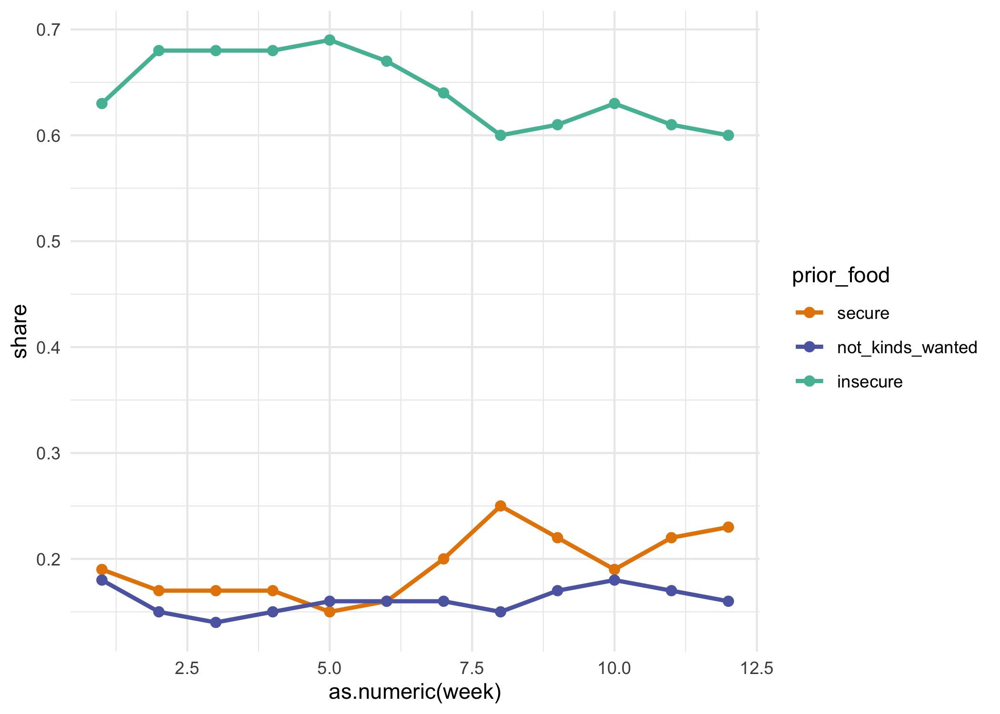<!-- -->

# by group

## work loss

``` r
by_group$work_loss <- srvys %>%
  compare_grps(wrkloss) %>%
  map(filter, wrkloss == "loss") %>%
  combine_dimensions(c(wks_incl, wrkloss))
```

    ## Adding missing grouping variables: `wks_incl`
    ## Adding missing grouping variables: `wks_incl`

## food insecurity (current)

``` r
by_group$food_insecurity <- srvys %>%
  compare_grps(current_food) %>%
  map(filter, current_food == "insecure") %>%
  combine_dimensions(c(wks_incl, current_food))
```

change less in share not having enough food, but share having limited
options

``` r
by_group$food_insecurity_change <- list(
  srvys %>%
    map(filter, !is.na(prior_food), !is.na(current_food)) %>%
    compare_share(kids_present, prior_food) %>%
    filter(prior_food != "secure"),
  srvys %>%
    map(filter, !is.na(prior_food), !is.na(current_food)) %>%
    compare_share(kids_present, current_food) %>%
    filter(current_food != "secure")
) %>%
  map(select, -share_se) %>%
  map_dfr(pivot_longer, ends_with("_food"), names_to = "variable", values_to = "group", names_ptypes = list(variable = factor()))

by_group$food_insecurity_change %>%
  ggplot(aes(x = variable, y = share, fill = group)) +
  geom_col(position = position_stack(), width = 0.8) +
  scale_fill_carto_d(palette = "Vivid") +
  facet_wrap(vars(name, kids_present)) +
  labs(title = "previous vs current food insecurity")
```

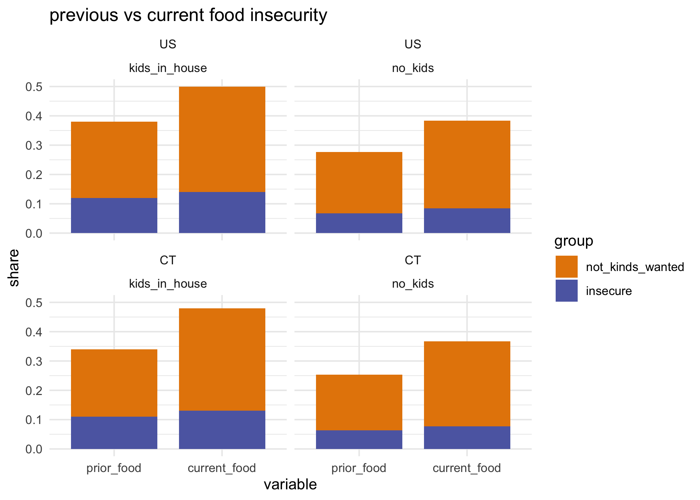<!-- -->

## received free food

``` r
by_group$free_food <- srvys %>%
  compare_grps(freefood) %>%
  map(filter, freefood == "received_food") %>%
  combine_dimensions(c(wks_incl, freefood))
```

## delayed care

``` r
by_group$delayed_med_care <- srvys %>%
  compare_grps(delay_care) %>%
  map(filter, delay_care == "delayed") %>%
  combine_dimensions(c(wks_incl, delay_care))
```

## missed care

``` r
by_group$missed_med_care <- srvys %>%
  compare_grps(miss_care) %>%
  map(filter, miss_care == "missed") %>%
  combine_dimensions(c(wks_incl, miss_care))
```

## anxiety

``` r
by_group$anxiety <- srvys %>%
  compare_grps(anxious) %>%
  map(filter, anxious == "most_all_days") %>%
  combine_dimensions(c(wks_incl, anxious))
```

## housing insecurity—next month

``` r
by_group$housing_insecurity <- srvys %>%
  compare_grps(housing_conf) %>%
  map(filter, housing_conf == "not_confident") %>%
  combine_dimensions(c(wks_incl, housing_conf))
```

### renters only

``` r
by_group$renter_insecurity <- srvys %>%
  map(filter, tenure == "rent") %>%
  compare_grps(housing_conf) %>%
  map(filter, housing_conf == "not_confident") %>%
  combine_dimensions(c(wks_incl, housing_conf))
```

## internet reliably available for kids’ education

kinda messy & large MOEs, not keeping

``` r
# messy
internet_no_output <- srvys %>%
  compare_grps(internet, age_range = FALSE, kids_present = FALSE) %>%
  map(filter, internet == "not_reliable") %>%
  combine_dimensions(c(wks_incl, internet))
```

``` r
compare_bars <- function(df) {
  ggplot(df, aes(x = fct_rev(group), y = share, fill = dimension)) +
  geom_col(width = 0.8) +
  coord_flip() +
  scale_y_continuous(expand = expansion(mult = c(0, 0.05)), labels = scales::percent_format(accuracy = 1)) +
  scale_fill_carto_d(palette = "Vivid") +
  facet_grid(rows = vars(dimension), scales = "free_y", space = "free") +
  theme_minimal() +
  theme(legend.position = "none",
        axis.ticks = element_blank(),
        plot.title.position = "plot") +
    labs(subtitle = "CT groups, all weeks", x = NULL, y = NULL)
}
```

``` r
by_group <- by_group %>% map(filter, group != "other")

by_group$work_loss %>%
  filter(name == "CT" | dimension == "total") %>%
  compare_bars() +
  labs(x = NULL, y = NULL,
       title = "loss of employment income since 3/13")
```

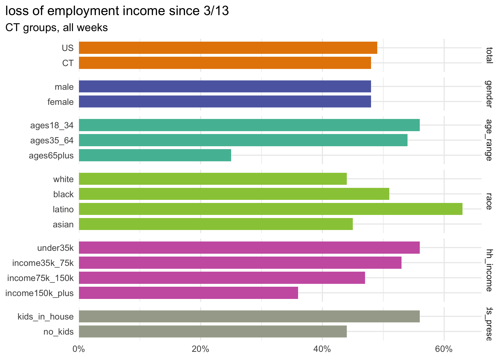<!-- -->

``` r
by_group$food_insecurity %>%
  filter(name == "CT" | dimension == "total") %>%
  compare_bars() +
  labs(x = NULL, y = NULL,
       title = "food insecurity in past 7 days")
```

<!-- -->

``` r
by_group$delayed_med_care  %>%
  filter(name == "CT" | dimension == "total") %>%
  compare_bars() +
  labs(x = NULL, y = NULL,
       title = "delayed medical care in past 4 weeks")
```

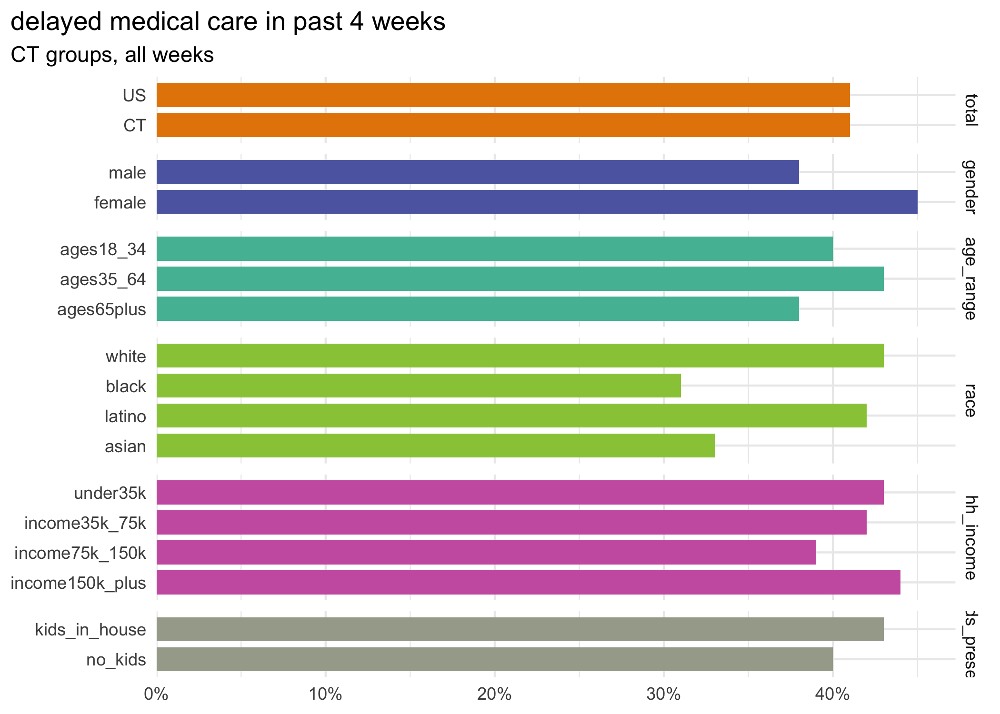<!-- -->

``` r
by_group$missed_med_care  %>%
  filter(name == "CT" | dimension == "total") %>%
  compare_bars() +
  labs(x = NULL, y = NULL,
       title = "missed medical care not related to covid in past 4 weeks")
```

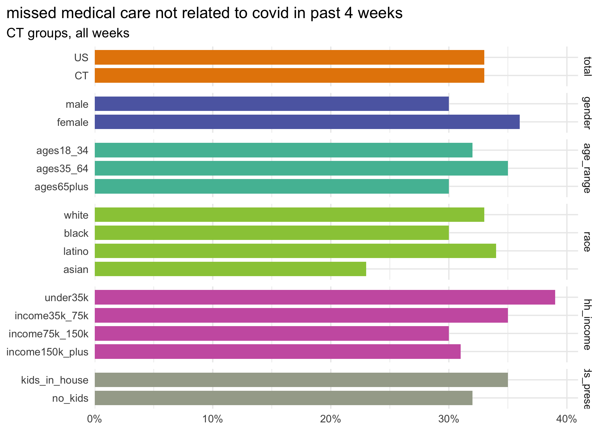<!-- -->

``` r
by_group$anxiety %>%
  filter(name == "CT" | dimension == "total") %>%
  compare_bars() +
  labs(x = NULL, y = NULL,
       title = "anxiety half the days in past week or more")
```

<!-- -->

``` r
by_group$housing_insecurity %>%
  filter(name == "CT" | dimension == "total") %>%
  compare_bars() +
  labs(x = NULL, y = NULL,
       title = "little/no confidence in making next housing payment")
```

<!-- -->

``` r
by_group$renter_insecurity %>%
  filter(name == "CT" | dimension == "total") %>%
  compare_bars() +
  labs(x = NULL, y = NULL,
       title = "little/no confidence in making next housing payment--renters only")
```

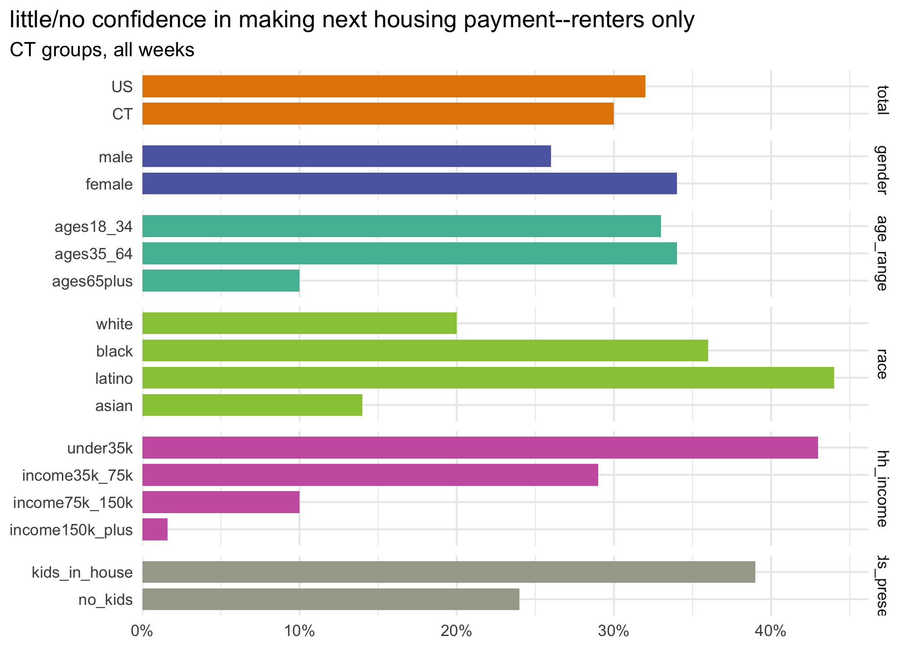<!-- -->

``` r
saveRDS(trends, here::here("output_data/hhp_trends.rds"))
saveRDS(by_group, here::here("output_data/hhp_by_group.rds"))
```

# specific food access questions

food sufficiency questions universe: current food not enough / not types
wanted

``` r
# just a little easier to handle food vars separately
food_df <- pums_df %>%
  select(state:hh_income, race, age_range, kids_present, current_food, cant_afford = foodsufrsn1, transportation = foodsufrsn2, afraid_to_go_out = foodsufrsn3, need_delivered = foodsufrsn4, stores_didnt_have_food = foodsufrsn5, freefood, school = wherefree1, pantry = wherefree2, home_delivery = wherefree3, church = wherefree4, shelter = wherefree5, comm_program = wherefree6, family = wherefree7) %>%
  mutate_at(vars(cant_afford:stores_didnt_have_food), ~case_when(
    current_food == "secure" ~ NA_character_,
    is.na(.) ~ "didnt_need",
    TRUE ~ "needed"
  ) %>% as.factor()) %>%
  mutate_at(vars(school:family), ~case_when(
    freefood == "no_free_food" ~ NA_character_,
    is.na(.) ~ "didnt_use_source",
    TRUE ~ "used_source"
  ) %>% as.factor())

summary(food_df)
```

    ##     state             wks_incl              week          start_date        
    ##  Length:819150      Length:819150      3      :132961   Min.   :2020-04-23  
    ##  Class :character   Class :character   8      :108062   1st Qu.:2020-05-14  
    ##  Mode  :character   Mode  :character   5      :105066   Median :2020-05-28  
    ##                                        4      :101215   Mean   :2020-05-28  
    ##                                        9      : 98663   3rd Qu.:2020-06-18  
    ##                                        6      : 83302   Max.   :2020-06-25  
    ##                                        (Other):189881                       
    ##     end_date             scram              pweight            gender      
    ##  Min.   :2020-05-05   Length:819150      Min.   :     2.0   male  :331688  
    ##  1st Qu.:2020-05-19   Class :character   1st Qu.:   295.5   female:487462  
    ##  Median :2020-06-02   Mode  :character   Median :   802.9                  
    ##  Mean   :2020-06-03                      Mean   :  2737.6                  
    ##  3rd Qu.:2020-06-23                      3rd Qu.:  2309.7                  
    ##  Max.   :2020-06-30                      Max.   :447765.7                  
    ##                                                                            
    ##            hh_income          race             age_range     
    ##  under35k       :140161   white :622680   ages18_34 :134105  
    ##  income35k_75k  :203984   black : 61418   ages35_64 :482981  
    ##  income75k_150k :232943   latino: 70166   ages65plus:202064  
    ##  income150k_plus:132291   asian : 35923                      
    ##  NA's           :109771   other : 28963                      
    ##                                                              
    ##                                                              
    ##         kids_present              current_food        cant_afford    
    ##  kids_in_house:290463   secure          :538650   didnt_need:180356  
    ##  no_kids      :528687   not_kinds_wanted:215221   needed    :100144  
    ##                         insecure        : 49264   NA's      :538650  
    ##                         NA's            : 16015                      
    ##                                                                      
    ##                                                                      
    ##                                                                      
    ##     transportation     afraid_to_go_out     need_delivered  
    ##  didnt_need:250847   didnt_need:209085   didnt_need:262480  
    ##  needed    : 29653   needed    : 71415   needed    : 18020  
    ##  NA's      :538650   NA's      :538650   NA's      :538650  
    ##                                                             
    ##                                                             
    ##                                                             
    ##                                                             
    ##  stores_didnt_have_food          freefood                   school      
    ##  didnt_need:147407      received_food: 49969   didnt_use_source: 46087  
    ##  needed    :133093      no_free_food :750502   used_source     : 22561  
    ##  NA's      :538650      NA's         : 18679   NA's            :750502  
    ##                                                                         
    ##                                                                         
    ##                                                                         
    ##                                                                         
    ##               pantry                home_delivery                 church      
    ##  didnt_use_source: 56477   didnt_use_source: 66583   didnt_use_source: 62428  
    ##  used_source     : 12171   used_source     :  2065   used_source     :  6220  
    ##  NA's            :750502   NA's            :750502   NA's            :750502  
    ##                                                                               
    ##                                                                               
    ##                                                                               
    ##                                                                               
    ##              shelter                 comm_program                 family      
    ##  didnt_use_source: 68079   didnt_use_source: 58289   didnt_use_source: 56963  
    ##  used_source     :   569   used_source     : 10359   used_source     : 11685  
    ##  NA's            :750502   NA's            :750502   NA's            :750502  
    ##                                                                               
    ##                                                                               
    ##                                                                               
    ## 

``` r
fsrvys <- list(
  us = as_survey_design(food_df, weights = pweight),
  ct = as_survey_design(food_df %>% filter(state == "09"), weights = pweight)
) %>%
  map(group_by, wks_incl)
```

## sources of free food

of adults getting free food in past 7 days

``` r
food_sources <- food_df %>%
  select(school:family) %>%
  names() %>%
  set_names() %>%
  map(function(col_name) {
    col <- sym(col_name)
    fsrvys %>%
      compare_grps({{ col }}, hh_income = FALSE) %>%
      map(filter, {{ col }} == "used_source") %>%
      combine_dimensions(c(wks_incl, {{ col }}))
  }) %>%
  map(filter, group != "other")
```

``` r
food_sources$school %>%
  filter(name == "CT" | dimension == "total") %>%
  compare_bars() +
  labs(title = "received free food through schools, other kids' programs",
       caption = "of adults receiving free food in past 7 days")
```

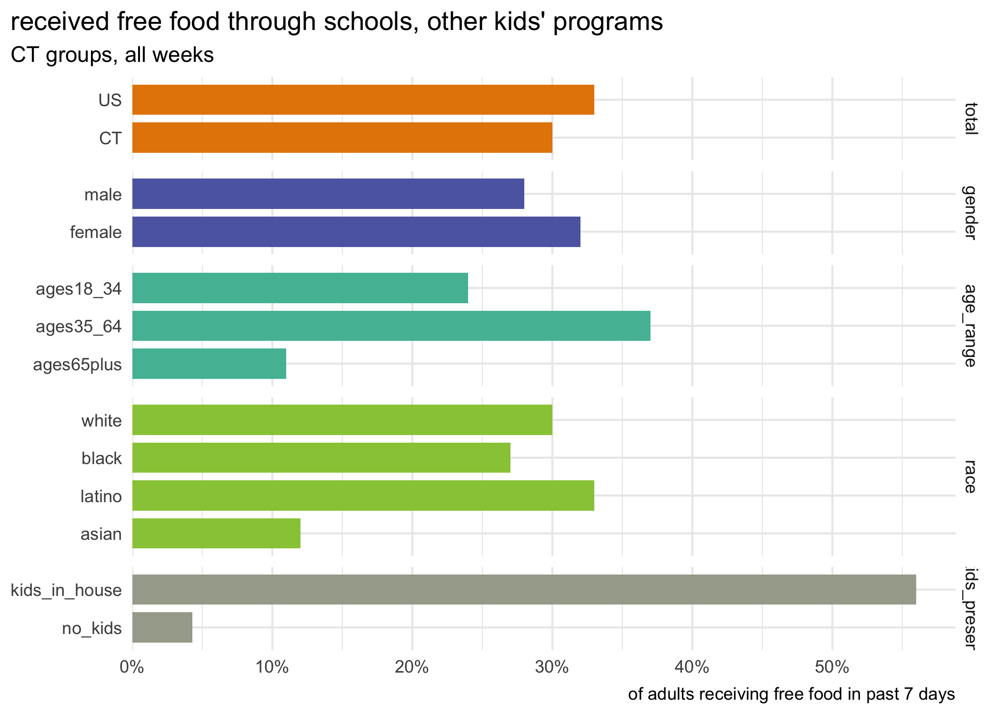<!-- -->

``` r
food_sources$family %>%
  filter(name == "CT" | dimension == "total") %>%
  compare_bars() +
  labs(title = "received free food through family or friends",
       caption = "of adults receiving free food in past 7 days")
```

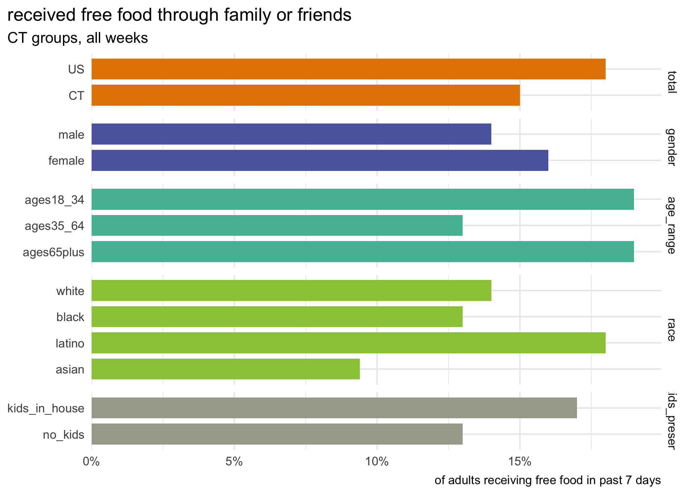<!-- -->

``` r
food_sources$pantry %>%
  filter(name == "CT" | dimension == "total") %>%
  compare_bars() +
  labs(title = "received free food through food pantry / food bank",
       caption = "of adults receiving free food in past 7 days")
```

<!-- -->

Key takeaway: people living with kids rely heavily on schools for food,
whereas people not living with kids & seniors rely heavily on food
pantries & food banks.

``` r
food_sources %>%
  map_dfr(pivot_longer, -c(name, wks_incl, share:group), names_to = "source") %>%
  filter(name == "CT", dimension == "total") %>%
  mutate(source = as_factor(source) %>% fct_reorder(share, .fun = max)) %>%
  ggplot(aes(x = source, y = share)) +
  geom_col(width = 0.8, fill = "#008b60") +
  geom_text(aes(label = scales::percent(share, accuracy = 1)), color = "white", hjust = 1, nudge_y = -2e-3, size = 2.5, fontface = "bold") +
  scale_y_continuous(expand = expansion(mult = c(0, 0.05)), breaks = NULL) +
  coord_flip() +
  theme_minimal() +
  theme(panel.grid = element_blank(),
        axis.ticks = element_blank(),
        plot.title.position = "plot") +
  labs(title = "source of free food",
       x = NULL, y = NULL)
```

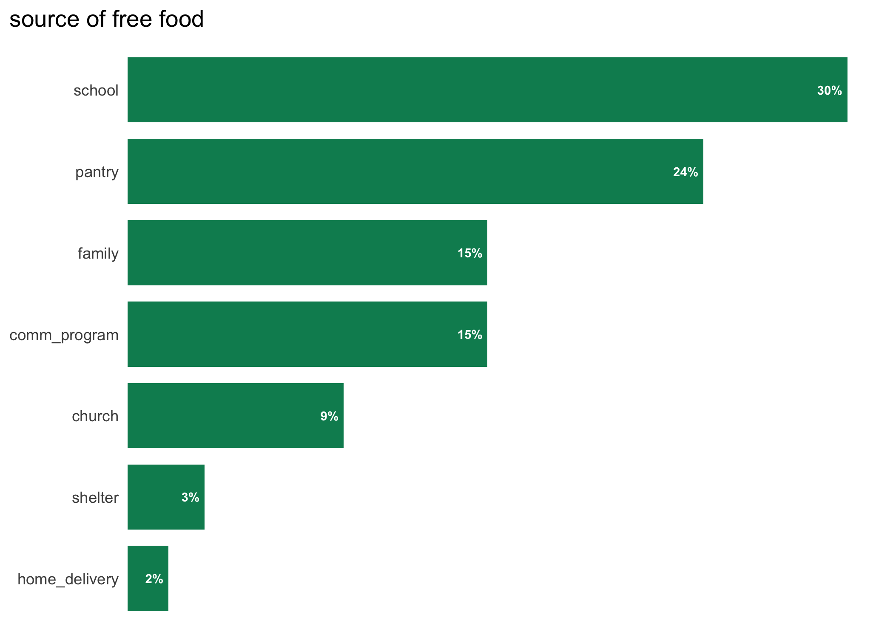<!-- -->

## barriers to food access

of adults experiencing shortage of food / desired types of food in past
7 days

``` r
food_barriers <- food_df %>%
  select(cant_afford:stores_didnt_have_food) %>%
  names() %>%
  set_names() %>%
  map(function(col_name) {
    col <- sym(col_name)
    fsrvys %>%
      compare_grps({{ col }}, hh_income = FALSE) %>%
      map(filter, {{ col }} == "needed") %>%
      combine_dimensions(c(wks_incl, {{ col }}))
  }) %>%
  map(filter, group != "other")
```

``` r
food_barriers$cant_afford %>%
  filter(name == "CT" | dimension == "total") %>%
  compare_bars() +
  labs(title = "couldn't afford food",
       caption = "of adults not having enough / desired food in past 7 days")
```

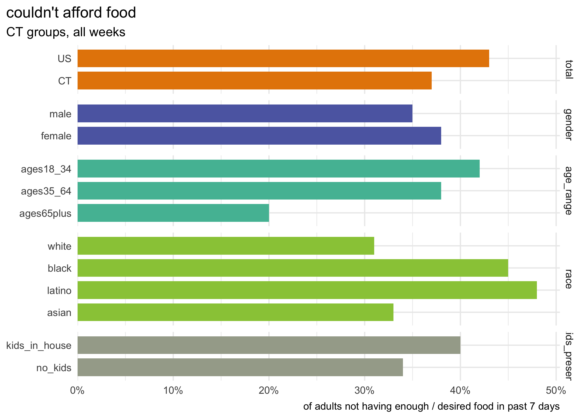<!-- -->

``` r
food_barriers$transportation %>%
  filter(name == "CT" | dimension == "total") %>%
  compare_bars() +
  labs(title = "needed transportation to get food",
       caption = "of adults not having enough / desired food in past 7 days")
```

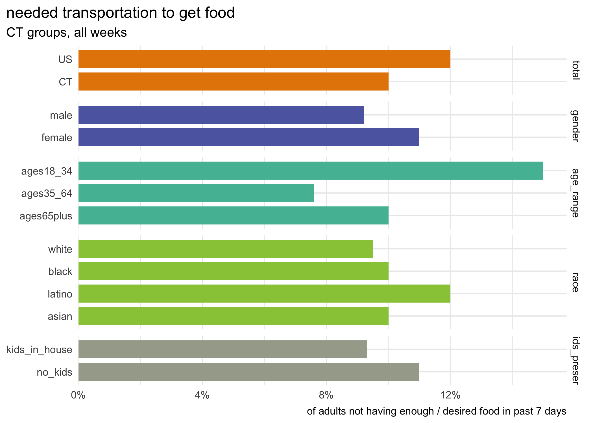<!-- -->

``` r
food_barriers$need_delivered %>%
  filter(name == "CT" | dimension == "total") %>%
  compare_bars() +
  labs(title = "needed food delivered",
       caption = "of adults not having enough / desired food in past 7 days")
```

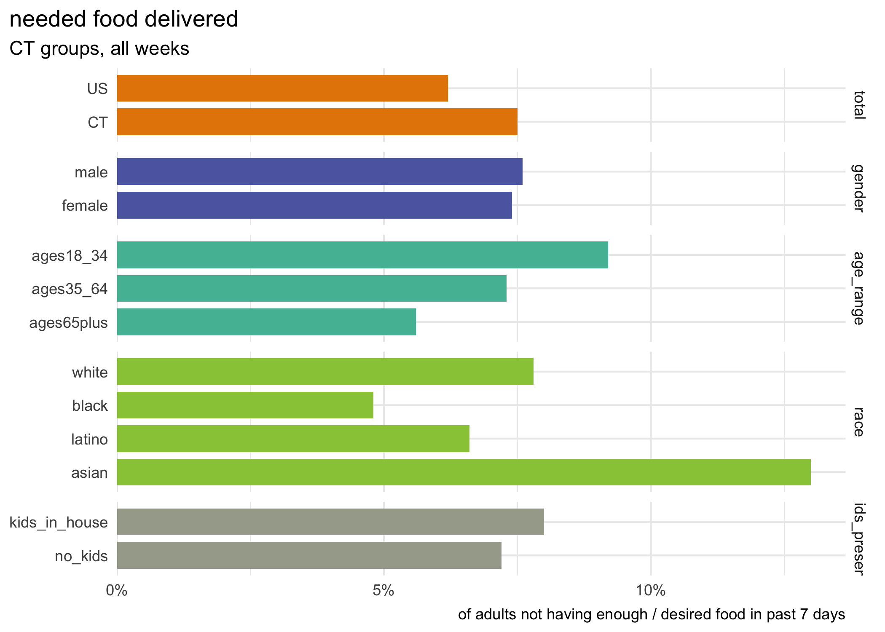<!-- -->

## resources x health

Interested in how anxiety differs by food insecurity, housing
insecurity, etc

``` r
resource_x_health <- list()
```

``` r
resource_x_health$anxiety_x_food <- srvys %>%
  map(filter, !is.na(current_food), !is.na(anxious)) %>%
  compare_share(current_food, anxious) %>%
  filter(anxious == "most_all_days", name == "CT")

resource_x_health$anxiety_x_housing <- srvys %>%
  map(filter, !is.na(housing_conf), !is.na(anxious)) %>%
  compare_share(housing_conf, anxious) %>%
  filter(anxious == "most_all_days", name == "CT")

resource_x_health$anxiety_x_delay_care <- srvys %>%
  map(filter, !is.na(delay_care), !is.na(anxious)) %>%
  compare_share(delay_care, anxious) %>%
  filter(anxious == "most_all_days", name == "CT")

resource_x_health$anxiety_x_tenure <- srvys %>%
  map(filter, !is.na(tenure), !is.na(anxious)) %>%
  compare_share(tenure, anxious) %>%
  filter(anxious == "most_all_days", name == "CT", tenure != "other")

resource_x_health %>%
  map_dfr(pivot_longer, c(-name, -wks_incl, -anxious, -starts_with("share")), names_to = "measure", values_to = "group") %>%
  mutate_at(vars(measure, group), fct_relabel, camiller::clean_titles) %>%
  mutate(measure = fct_recode(measure, "Food insecure" = "Current food", "Confidence in next housing payment" = "Housing conf")) %>%
  ggplot(aes(x = group, y = share)) +
  geom_col(width = 0.8, fill = "#008b60") +
  geom_text(aes(label = scales::percent(share, accuracy = 1)), size = 2.8, hjust = 1, nudge_y = -8e-3, fontface = "bold", color = "white") +
  scale_y_continuous(expand = expansion(mult = c(0, 0.05)), breaks = NULL) +
  facet_grid(rows = vars(measure), scales = "free", space = "free", switch = "y",
             labeller = labeller(measure = label_wrap_gen(20))) +
  coord_flip() +
  labs(x = NULL, y = NULL,
       title = "Anxiety rate vs access to resources") +
  theme(strip.text.y = element_text(angle = 0, face = "bold"),
        strip.placement = "outside",
        panel.grid = element_blank(),
        plot.title.position = "plot",
        panel.spacing = unit(0.2, "in"))
```

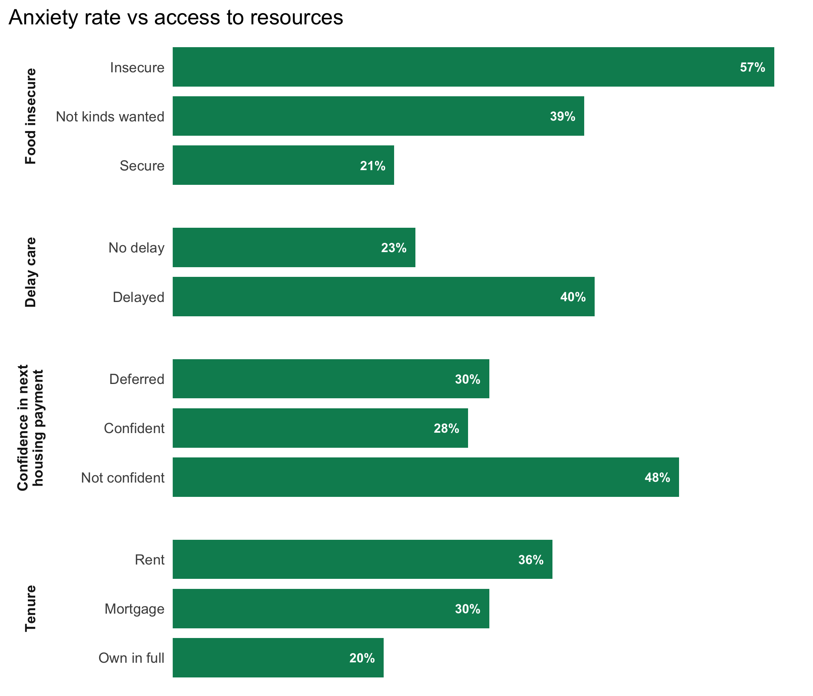<!-- -->

Not super surprising: people are more anxious who have also been food
insecure, delayed medical care, worried about next housing payment, and
who rent. Definitely more we could dig into here.

``` r
saveRDS(food_sources, here::here("output_data/hhp_sources_of_food.rds"))
saveRDS(food_barriers, here::here("output_data/hhp_barriers_to_food.rds"))
```

``` r
write_csv(week_dates, here::here("_utils/pums_week_dates.csv"))
```

Not ready yet: curious about how many people have become food insecure /
experienced insecurity at some point

``` r
rep_ids <- all_pums %>%
  map_dfr(janitor::clean_names, .id = "wk") %>%
  filter(est_st == "09", !is.na(curfoodsuf)) %>%
  count(scram) %>%
  arrange(-n) %>%
  filter(n > 1)

ct_srvy %>%
  filter(!is.na(current_food)) %>%
  # as_tibble() %>%
  group_by(scram) %>%
  mutate(insecure = current_food == "insecure",
         insecure_so_far = cumsum(insecure) > 0) %>%
  ungroup() %>%
  select(scram, week, current_food, insecure, insecure_so_far) %>%
  # arrange(scram)
  group_by(week) %>%
  summarise(share_current = survey_mean(insecure, na.rm = TRUE),
            share_ever = survey_mean(insecure_so_far, na.rm = TRUE, vartype = "ci", level = 0.9))
```

    ## # A tibble: 9 x 6
    ##   week  share_current share_current_se share_ever share_ever_low share_ever_upp
    ##   <fct>         <dbl>            <dbl>      <dbl>          <dbl>          <dbl>
    ## 1 1            0.0895           0.0167     0.0895         0.0620          0.117
    ## 2 2            0.0869           0.0222     0.0990         0.0611          0.137
    ## 3 3            0.119            0.0282     0.135          0.0872          0.182
    ## 4 4            0.0912           0.0210     0.114          0.0753          0.152
    ## 5 5            0.0965           0.0167     0.107          0.0787          0.135
    ## 6 6            0.102            0.0231     0.112          0.0735          0.151
    ## 7 7            0.103            0.0231     0.113          0.0739          0.152
    ## 8 8            0.102            0.0171     0.126          0.0919          0.160
    ## 9 9            0.0922           0.0141     0.109          0.0810          0.137
